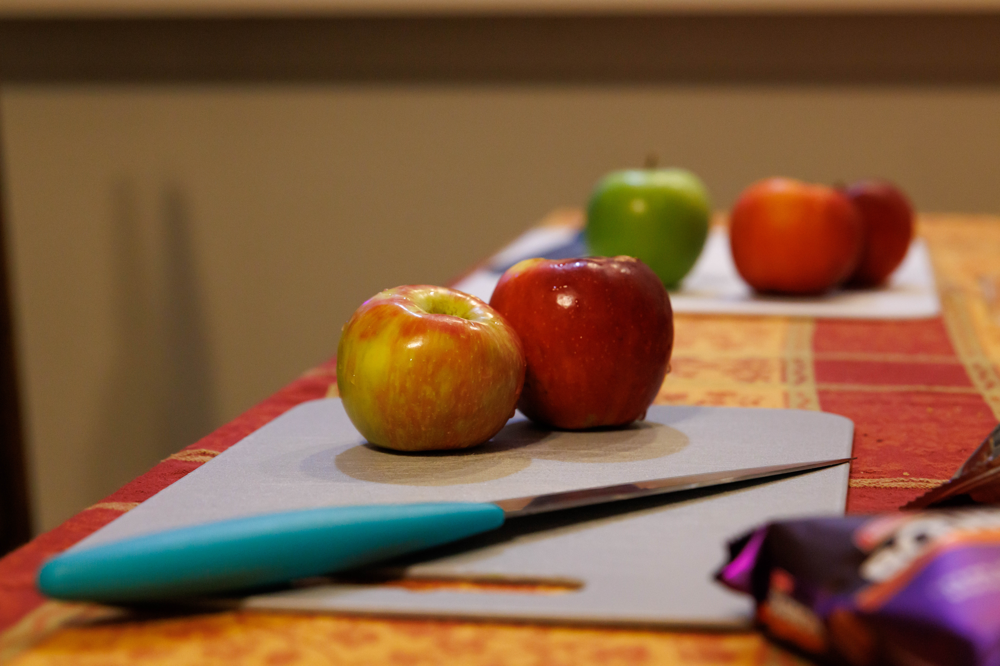
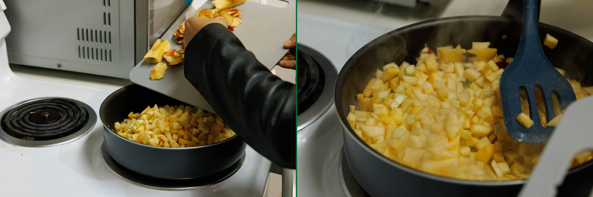
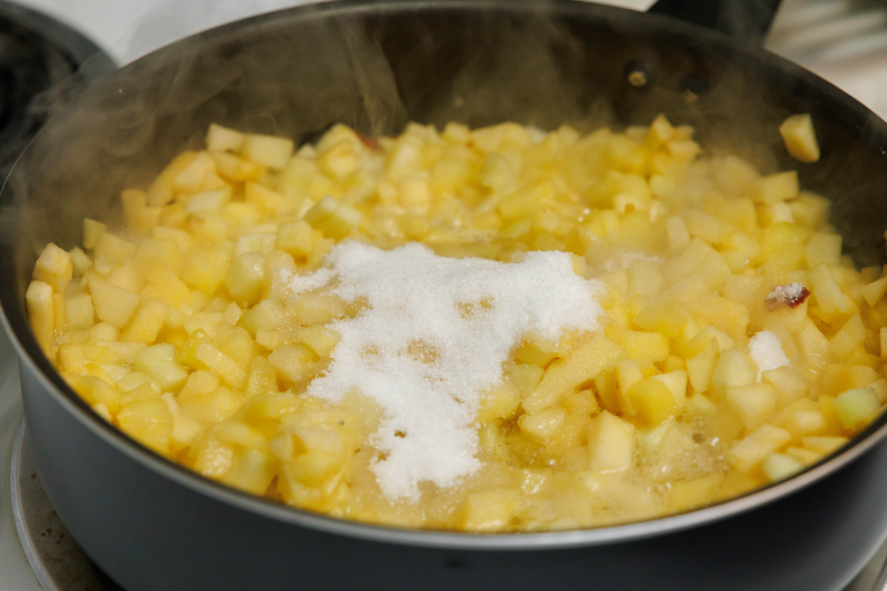

Let the record show that I do *not* like jam. I've never been a fan of it. It's got a weird texture and all the mushy bits inside are unpleasant at best to chomp down on.

I know there's a difference between jam and jelly and preserve and a fourth thing whose name escapes my tongue, but I don't know what that difference is, so my mind lumps them all together into a category of *foodstuff I dislike*.

### Pies & Stuff

What really sucks is that one of my favorite shows, *Pushing Daisies*, is all about pies. Conceptually, I love the idea of a pie. It is a wonderfully beautiful baked form in which to consume a miscellany of delightful ingredients. I fantasize of decorating pies with dough origami, of making a filling that matches the fantastically imaginative flavors featured on *Pushing Daisies*[^1], or coming up with my own bespoke combinations of unlikely ingredients.

But as much as I want to fall in love with pies because of the show, I can't because pies are really just fancy bread stuffed with warm jams. And as I've said, I do *not* like jam.

I want to fix this. And so I have hatched a plan. I want to start a series called *Will It Jam?* to force myself into liking jam.
### Will It Jam?

I've seen a YouTube series floating around called "Will It Rat" by Nichet Crochet. It's shtick is to see whether or not unconventional crochet materials can be used to crochet a rat. He's tried crocheting rats out of things like silver pom-pom tinsel and ramen to varying degrees of success. When I first found this series, I thought I'd struck gold. What an imaginative idea! I filed it away in my mind under "inspiration to come back to later."

Well, today is later.

I was having a flower cake with a friend. It was rose-flavored, and my friend asked me how I liked it. He'd forgotten to ask me if I liked rose-flavored things[^2]. One thing led to another (yes, I know, a delightfully concise description) and we started talking about IgNobel prizes and making jams.

I began to imagine myself making a series of experimental jams, beginning with normal jam ingredients and slowly transmogrifying into the unconventional (and maybe even those forbidden in culinary circles) because, like I've said, I do *not* like jams, and I thought this disconnect would be comedy in a jar.

I've never made a jam before. The thought had literally never crossed my mind. But here I was with four apples in the fridge (that I'd picked several weeks ago) which I knew I'd keep forgetting to eat if not for immediate, decisive action. And here I was with a half-baked scheme to start making random jams for the fun of it.

Apples naturally contain pectin, which means they're incredibly easy to jam. I'm not going to get into what makes a jam in this post, but pectin is a polymer essential to the jamming process. So I looked up apple jam recipes and decided to embark on a quest to conquer my distaste of jams and grow closer to my favorite TV show.
### The Quest Begins

I pulled out all the apples I had. It turns out I had five--  two medium sized ones from the apple picking adventure I'd been on; one massive green unripe apple I'd gotten from as a free fruit accompanying an egg and cheese biscuit I'd gotten at a campus cafe; one small apple from the camping trip I'd been on this past weekend; and one of undeterminable origin I'd been storing in the bottom of my latest cereal box for a rainy day. I pulled them out and laid them on the table, getting ready to cut them up. One of my roommates offered up an apple from *their* recent apple-picking trip, rounding up our motley batch of apples to a nice clean half-dozen.

 Apples lined up for slaughter 

And so we sat down at the dining table, blasted Jammin' from Strawberry Shortcake, and started peeling, coring, and dicing the apples to prepare them to be jammed. This was a mostly uneventful step, the only exception being when I sliced into my thumb as I was finishing up the dicing. Luckily, I managed to hit only the nail and avoided all flesh. The jam gods were smiling at me, and I knew this was a sign to continue on my journey.
### Departure

We moved the apple pieces over to the stove, and put them in a flat pan to start reducing them. We were half-following a recipe we'd found online, substituting ingredients as needed and changing quantities on vibe-based whims. As you can imagine, this is about where the successes started to stop.

We'd added in the apple cores and the largest apple peels to begin with so that we'd have more pectin to start the jamming process. But we realized this wasn't really necessary and that it would be easier to just remove the pieces now before it became a hassle later. So we fished out all of the peels and cores and got ready to add the other ingredients.

We started by pouring a quarter cup of lemon juice into the mixture. This was our substitute for apple cider vinegar. We added about a half cup of water to the pan and cranked the stove up to eight. As it started to boil, I realized we hadn't added sugar yet and scrambled to find some.

See, the only thing I knew about jams going in is that they needed a lot of sugar. That's how they last so long. I didn't know how much to actually add, so I made a ballpark estimate and went with a cup.

 A truly mountainous amount of sugar in all its sickly sweetness. 

 And to think, this was just a third of it! 

I grabbed a dark blue spatula whose sheen sort of matched with the blue of the pan and began to evenly stir the apples, folding the sugar into the gooey mixture. We sprinkled some allspice and cinnamon into the pan-- those felt like normal spices for jam; spices that felt like they would enhance the apple-ness of the finished product.

And now began the long wait of reducing the jam.
### A Minor Setback

I like handwashing dishes. I *love* handwashing dishes. Now that the primordial jam was in the pan, I figured I could start washing the utensils we used so I could restock the kitchen armory and wash my teacups and saucers while I was at it.

I put on some music (Strawberry Switchblade's eponymous album) and began to scrub away at the grime while jamming out in the kitchen. I was expecting another friend over to study and was killing the time until they came.

At the start, I remembered to keep stirring the jam. When I set my mind on something, it'll happen, no matter the task. 

 Look! A jam-in-progress, well-stirred in regular intervals! 

Unless, of course, I get distracted. But handwashing is so much more fun than making jam. So I forgot to remember to stir the jam with the little dark blue plastic spatula and, without my even realizing it, the jam had begun to conspire against me.

I'd just about finished my handwashing, and another roommate came downstairs to grab dinner. They asked about what I was making and politely mentioned she thought it was burnt.

There's no way, I thought. 

I've been thoroughly stirring this mixture off and on now for like thirty minutes. And then I turned around to look at the pan and saw the apples staring at me darkly in all their burnt fury.

### Discombobulated Jamming

Well, fuck, I thought.

Here is my first time making jam and I have already messed up!

For those of you who are also not jam-inclined. This is quite possibly the easiest type of jam to make at home. It's really just reduced apples and sugar. So it was kind of impressive, burning it like I did.

So I kind of stood there for a second, and began to stir the crispy apple chunks in the pan. Oh, they were burnt all right. I hastily filled up a teacup with tap water and dumped it over the pan, as if another cup would do me any good.

In desperation, I knocked on the door of our resident jam expert for advice. He took one look at my concoction and knew what to do. He poured a lot of water onto the pan and instructed me to keep simmering it until all the water had boiled off. I followed his instructions and kept the stove on until the texture of the dark goop began to look and feel like my mental image of jam.

### Canning It

And so the jam was made. It was time to can the monstrosity I'd created.

I spooned the jam into a mason jar, coated the rim with rice vinegar, and sealed the lid. Lo and behold, jarred apple jam! 

I haven't tasted this jam as of writing this post yet. I'm a bit frightened, if I'm being honest. But jam number one is down, and it can only get more interesting from here. What does this say for the future of my jam career if I can't even manage to make apple jam correctly? Stay tuned for my adventures in jamming. Next time I might even delve into the chemistry behind jams.

[^1]: I say this like the pies are out there. They're not. They're deeply normal pie flavors like "berry" and "apple tart" and "key lime" and "Kahlua cream cheese."

[^2]: It's not relevant to this story, but I think I do. Floral flavors can be overwhelmingly strong sometimes, but I'm generally a fan. I had cake-e Yazdi (an Iranian cardamom rosewater cupcake) the other day and they were absolutely delightful.

