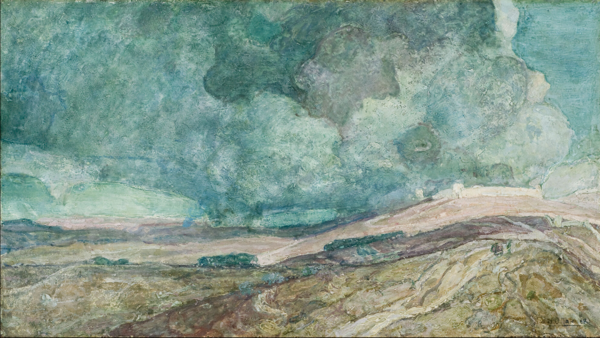

You know the way they always describe it, seeing art? And I mean *seeing*, seeing proper, not just looking?

Standing in front of a painting, transfixed, as if the thick strokes of paint on the canvas are coming back to life, their temperal tendrils reaching out to wrap around your heart like a muscle, in order to quicken the already restless drumbeat coursing through your body? Standing frozen everywhere except for your eyes which become a whirlpool of ritual, fixing this moment to memory; and your smile which widens slowly and asymmetrically like a crack in time?

That happened to me, dear reader, almost two years ago; it happened when I first saw Henry Ossawa Tanner's *Destruction of Sodom and Gomorrah*.

### *The Destruction of Sodom and Gomorrah*

Take a second, maybe fifteen, to look at the painting before going ahead. Here's a picture embedded on this article. You can also check it out on the [High's website](https://high.org/collection/destruction-of-sodom-and-gomorrah/), it's higher resolution there. And of course, you can go view it in person if you happen to be in Atlanta. It's on permanent display, although the bench that used to sit in front of it has gotten up and moved elsewhere.

---
It was the final Second Sunday of the year, which meant free admission. I was there with two friends to take a look at the exhibit [Beatrix Potter: Drawn to Nature](https://high.org/exhibition/beatrix-potter/)[^1] which focused on the development of Beatrix Potter's artistic career.

While we were there we might as well check out the rest of the museum. I'd been to the High a few times already but usually with a special exhibit in mind. I don’t think I’d intentionally looked at its permanent collection before, though, otherwise I would have met it sooner. 

We start circling through the building floor by floor, snaking through the galleries and ascending with the winding ramp that curves through the atrium. As soon as we hit the second floor I saw it across the room and stopped dead in my tracks. Almost without thinking I pulled myself over to stand in front of it and absorb its beauty.

And *oh*, how beautiful it was! 

Clouds of turquoise and seafoam and pearl and cabbage whorling about like an oil spill in the skies. A desert that's full of life because you *can see it* alive; you can see it rippling with paddies of green and brown; you can almost feel the shape of the wind, the same gentle wind that sculpted the dunes over millennia into the landscape they are now, ruffling your hair as it billows towards you in waves. Has destruction ever been this serene?

Where are Sodom and Gomorrah? Barely visible, they melt into the horizon until they're barely imprints in the distance. And Lot and his daughters, why, they blend into the desert like stones in a river-- it's not about them, this is hardly a biblical painting.

I defocus my eyes and look at the painting in whole. Everything melts together and it's like I'm seeing a greater beauty I can't understand.

----

Henry Ossawa Tanner[^2] was the first African-American artist to achieve international acclaim. He was the eldest of nine children, and his middle name commemorated the struggle at Ossawatomie between Free-Staters and pro-slavery Border ruffians. His father was a college-educated teacher, abolitionist, and minister (eventually bishop) in the African Methodist Episcopalian church. His mother was born into slavery and, depending on which account you believe, either escaped to Pennsylvania through the Underground Railroad or was driven by her father on an ox-cart to freedom. 

Although his parents initially opposed his career to painting, Tanner enrolled at the Pennsylvania Academy of the Fine Arts and was the only student. He left the school due to sickness, and spent a summer recuperating in the mountains. He moved down south to Atlanta for a few years, where he taught intermittently at Clark college and ran a photography store.

In 1891 he sailed to Rome with the help of his White patrons Bishop and Mrs. Joseph Crane Hartzell. During his travels, he fell in love with the arts scene of Paris and enrolled at the Académie Julian. His 1895 painting *Daniel in the Lion’s Den* thrust him in the spotlight and launched his career.

Much of Tanner’s portfolio is biblical in nature. The turquoise and teal elements in *The Destruction of Sodom and Gomorrah*– his favorite hues– were known as Tanner blues by his contemporaries, and were often used to signify the ethereal.

---
It’s November now, and I was craving a donut and a sickly sweet cold coffee. I also had a month-long free trial to the Dunkin’ rewards program that was about to run out, and I wanted to take advantage of the coupons while I could. I grabbed my headphones, threw on my coat and scarf, and stepped out of my house to began the trek[^3] to the nearest Dunkin’.

I'd recently gotten into podcasts-- specifically, one podcast; Poetry Unbound-- and had been listening to episodes on my commute and while walking around the city. I didn't feel like calling a friend on this particular walk so I pulled it up. First was *Miscegenation*[^4] by Natasha Trethaway. And next came *Of Course She Looked Back*[^5] by Natalie Diaz.

### *Of Course She Looked Back*

> You would have, too.
> From that distance the shivering city
> fit in the palm of her hand
> like she owned it.
> 
> She could’ve blown the whole thing—
> markets, dancehalls, hookah bars—
> sent the city and its hundred harems
> tumbling across the desert
> like a kiss. She had to look back.
> 
> When she did, she saw
> pigeons glinting like debris above
> ruined rooftops. Towers swaying.
> Women in broken skirts
> strewn along burned-out streets
> like busted red bells.
> 
> The noise was something else—
> dogs wept, roosters howled, children
> and guitars popped like kernels of corn
> feeding the twisting blaze.
> 
> She wondered had she unplugged
> the coffee pot? The iron?
> Was the oven off?
> Her husband uttered Keep going.
> Whispered Stay the course, or
> Baby, forget about it. She couldn’t.
> 
> Now a bursting garden of fire
> the city bloomed to flame after flame
> like hot fruit in a persimmon orchard.
> 
> Someone thirsty asked for water.
> Someone scared asked to pray.
> Her daughters or the crooked-legged angel,
> maybe. Dark thighs of smoke opened
> to the sky. She meant to look
> away, but the sting in her eyes,
> the taste devouring her tongue,
> and the neighbors begging her name.

(*Natalie Diaz, from When My Brother was an Aztec, 2012*)

Natalie Diaz writes to reimagine the story of Lot’s wife. Here, she has agency. Here, she is human. *Of course she looked back*, Diaz says, *you would have too*, and suddenly it’s you walking behind Lot and turning around. What is the Sodom that you see?

---
I’d heard the words Sodom and Gomorrah tossed around before, but I never really knew what the story was. I asked the two friends I was with at the High to explain it to me.

Lot, a family man living in Sodom, is visited by two angels sent by God[^6]. They’ve been sent to destroy the city, as it was swamped in wickedness. When they arrive at Lot’s, the all men in the town, both young and old, surround the house and demand the angels be sent out of the house so that the crowd may “know" them. This is where translation plays its role in the narrative, as some interpretations of the text treat it as “*to know carnally*”– the men of Sodom want to have sex with the visitors. Here is the origin of *sodomite*, *sod*, and *sodomy*, all differently homophobic terms.

This is the sin of Sodom that is blamed for the city’s destruction; this is the passage used to denounce homosexuality with the Bible. But the story continues. Lot refuses to send the angels out and instead offers his two virginal daughters to the mob. The mob refuse and the angels end up blinding them so they cannot find the door to Lot’s house.

The angels then warn Lot that they’ll be destroying the city. They tell him to evacuate with his family and to not look back, or they too will be swept away with the city. So Lot, his wife, and two daughters start to leave, heading for the desert. And this is where she looks back.

---
For Diaz, this is a personal poem. Born and raised in Fort Mojave Indian Village, Diaz is enrolled in the Gila Indian River Tribe. She’s a poet with two published collections– *When My Brother Was an Aztec* (2012) and the Pulitzer Prize-winning *Postcolonial Love Poem* (2020). But she’s also a linguist and has worked with the last Mojave Elders on a language revitalization program to preserve the language.

In Diaz’s poem Sodom is any city, any community, any *culture* that is being destroyed. It’s the slow death of people and their language. And Lot’s wife is *you*, or perhaps your ancestors or your neighbors who’ve felt this oppression; she is Diaz, who looks back to cup in her hands the Mojave language, with its handful of native speakers left.

This is a modern Sodom, with coffee-pots and ovens. Because the story of Sodom is timeless, is ongoing. There have been Sodoms across the world for as long as humans have had conflict. Someone is always losing their home.

When Lot’s wife stops on their trek to look back, “From that distance the shivering city / fit in the palm of her hand / like she owned it.” What a terribly beautiful and sad line! The city is alive here, and so frail and tiny that you can hold it all without resistance.

---
Another version of the destruction of Sodom and Gomorrah is a story about a fear of and violence towards outsiders[^7]. The angels are strangers, and so they must be brutalized. When Lot refuses, the mob cries out: “this fellow came here as a foreigner, and now he wants to play the judge! We’ll treat you worse than them.”

Think of the story of American Indian boarding schools, set up to civilize Native American youth. Natives were different, so they had to be assimilated. Their culture had to be erased and their language silenced. 

Think of slave America. Think of reconstruction when people refused to acknowledge the humanity of Black people. Think of the racism that still goes on, hidden better than before. 

Think of today’s immigration panic, and the state of terror that ICE has started across the nation. It’s nothing new, it’s all part of America’s playbook; primal instincts rising from the depths when it’s safe to resurface. There are Sodoms everywhere; left behind in the trail of violence and bigotry.

### Cabbage Skies

This poem is a poem of *resistance*. When your culture is being destroyed, it is a brave act to turn around and preserve what is left. It is courageous to look back and choose to remember in the face of the brutality of man.

To look back is important, because in the midst of destruction there is *always* something to preserve. In the Bible, Sodom is a lesson. A warning for an ambiguous sin whose definition has been argued over for millennia. But the people living in the town are real, more than just puppets in a fable. 

Lot’s wife looks back so she can remember the beauty in Sodom before it is quashed. She looks back so that she can see what is being destroyed as a consequence of the violence of man. Look, this is what foolishness leads to. Do not forget, because the minute you let yourself, history repeats itself.

Where is Lot’s wife in this painting? They’ve left her behind. How do they continue to walk away from their burning homes?

I know it’s not true, but I imagine that this painting *is* what Lot’s wife saw, and that *that* is the reason Henry Ossawa Tanner painted it so. Her family is off to the side and the city is in full frame. She looks back and instead of the destruction of everything she’s known she relives all the memories of her life in Sodom.

I think Tanner too would find Diaz’s poem beautiful. America has not been kind to him either:

>”I was extremely timid and to be made to feel that I was not wanted, although in a place where I had every right to be, even months afterwards caused me sometimes weeks of pain. Every time any one of these disagreeable incidents came into my mind, my heart sank, and I was anew tortured by the thought of what I had endured, almost as much as the incident itself.”

Tanner’s success is a *fuck you* to America and a testament to his passion for art. Many of his most famous paintings are subversions to racist art tropes, instead depicting African-Americans as real, without caricature. And his success made him an inspirational figure to aspiring African-American artists internationally. They too could make beautiful art, even if White America might not think so. They too could *be* beautiful in art.

There’s a lot more I can say about Tanner, but I think I’ll leave that for another time. This draft has been sitting for long enough as it is, and I think I’m losing my narrative a bit.

---

A final thing to close one. Even though these pieces are a century and a world apart, I know that this poem and painting were both created with the other in mind, that they were inked so I could stand in the streets of Washington D.C. with an iced coffee in hand and understand *why* my heart stood still in front of that painting of cabbage skies a year prior.
### Title Credits

[Orange Skies](https://www.youtube.com/watch?v=qPFQeFaIpOw) by Love. The first stanza is absolutely beautiful and sticks around in the back of my mind at all times:
> Orange skies  
> Carnivals and cotton candy and you  
> And I love you, too  
> You know I do

Also, another quick personal anecdote on *why* I wrote my thoughts about this down. Earlier last fall, I was at a Poetry@Tech reading featuring Rick Barot and Marie Howe. It was an evening of amazing poetry and I stuck around at the end of the night to get signatures from both poets. I was at the end of the line and got to talk with Rick Barot a bit. He mentioned he was going to the High the next day and I told him about the painting. He asked me if I’d written a poem about it yet.

Pretty much as soon as I decided to start this blog, I’d put “Cabbage Skies” verbatim on my little doc of writing ideas. That conversation was the impetus to brainstorm what the post would actually be. Now, it took weeks for me to start writing, and months to finish once I’d started, but I’m proud that I finally got this out.

---

[^1]: Coincidentally, I showed back up to the High for a lecture on Beatrix Potter by a Beatrix Potter scholar, and learned that amongst the amazing entrepreneurial, scientific, and capitalist things she had done she had also stumbled into a staunchly anti-suffrage perspective of life.

[^2]: The American Art museum has a slightly longer biography on their page [here](https://americanart.si.edu/artist/henry-ossawa-tanner-4742).

[^3]: For those of you invested in the geographies of this story, I was heading to the Dunkin' at 1739 New Jersey Ave. NW.

[^4]: [Miscegenation](https://onbeing.org/programs/natasha-trethewey-miscegenation/) by Natasha Trethaway. I had to listen to this poem multiple times and it led me to fall in love with the ghazal as a poetic form. I’ll be writing about this sometime soon.

[^5]: [Of Course She Looked Back](https://onbeing.org/programs/natalie-diaz-of-course-she-looked-back/) by Natalie Diaz, from *When My Brother was an Aztec,* 2012. That link is to the Poetry Unbound transcript of the poem. I also read [this Substack post](https://poemsfortheinbetween.substack.com/p/of-course-she-looked-back-48) by Jess Blackshaw and really enjoyed it, so I’m linking it as well.

[^6]: Wikipedia calls them “*male messengers*” which I find a hilarious term. Incidentally, while I’m mentioning Wikipedia, I finally made a Wikipedia account while reading up for this article. I’ve been keeping a list of “Wikipedia edits I want to make” for a while now, and when I went to add a minor grammatical error to the list I realized I should just make the account and stop putting it off. 

[^7]: [Opinion piece on another interpretation of Sodom and Gomorrah](https://www.westarinstitute.org/blog/sodom-and-gomorrah-how-the-classical-interpretation-gets-it-wrong)

