This post contains spoilers for *Kaitō Ruby* (1988), if you think it’s a movie that can be spoiled. It’s a wonderful movie about absolutely nothing at all, about a thief who hasn’t stolen anything yet and the fool smitten with her. This is, like most of my posts, a post about nothing. I just want to gush about this absolutely wonderful movie for a bit.

---
The opening sequence of *Kaitō Ruby* is one of the funniest I’ve ever seen. Toru Hayashi, a nerdy businessman played by Hiroyuki Sanada, is having breakfast with his mother when a supersized photo of Humphrey Bogart is hoisted past his window via a pulley. At first it’s just a view of Bogart’s piercing eyes and signature fedora, but with another length of the pulley he’s fully visible. The film cuts to Toru who sits in shock, and with yet another pull the window now frames Bogart’s gun, pointed directly at him. Toru is still in shock but of course by the time his mother (Kumi Mizuno) turns to look the poster is gone, now in the apartment of its owner, the mysterious self-declared thief Rumi ‘Ruby’ Kato (Kyoko Koizumi) who lives upstairs. Toru immediately drops his food, runs out, and heads to his scripted meet-cute with Ruby.

These first three minutes manage to capture the vibes of the movie perfectly. From the very start, Toru is already twisted around Ruby’s finger, he’s marching at the beat of her drum. And the comedic timing as the shots cut back and forth between Bogart and Toru foreshadow the movie’s comedy– *Kaitō Ruby* is driven entirely by a comedy of repetition. An event repeats itself and the comedy lies in how characters respond to it.

Ruby has just moved in, and when Toru first enters her apartment he steals a photo of her in a swimsuit and sheepishly runs off to work, where he oodles over her photo intermittently. When returning from work, Ruby asks him to grab her mail and invites him into her visually stunning top-floor apartment. She claims to be a stylist, and it makes sense– her place is littered with fashion magazines, and throughout her film her style is always striking. But over a beer she reveals her real identity:

> “I’m a criminal”
>
> “Like… someone who does bad things?”

Kaitō of *Kaitō Ruby* refers to the Japanese trope of the gentleman/lady thief, popularized in media through characters like Arsene Lupin III and Conan’s Kaito Kid. Ruby is a spoof of the trope– she’s got an electric personality but is comically bad at the crime. At the start of the film, she hasn’t actually committed a crime. But Toru is the perfect partner in crime– easily pliable, like gum on a sunny day. Here begins their life of crime, and their first gig is robbing a store around the corner. It would be very easy for me to just write a detailed summary of the movie, so I’ll reign myself in here and stick to the broad strokes. *editorial note: I failed monumentally and what follows is a summary of the movie anyways because I was enjoying rewatching it too much and it was hard to narrow down screenshots. Some funny quotes inserted. Really, this should just be a video essay that’s a love letter to this movie.* 

Over the course of the movie, Ruby and Toru commit five crimes together:

1. Robbing an old gentleman’s grocery, where they spend more money in prepping for the crime than they steal. In the end they return what they stole and Toru gets caviar as a reward

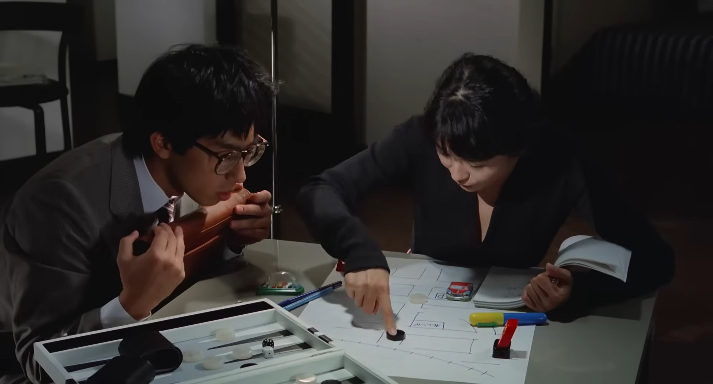

Plotting the first crime

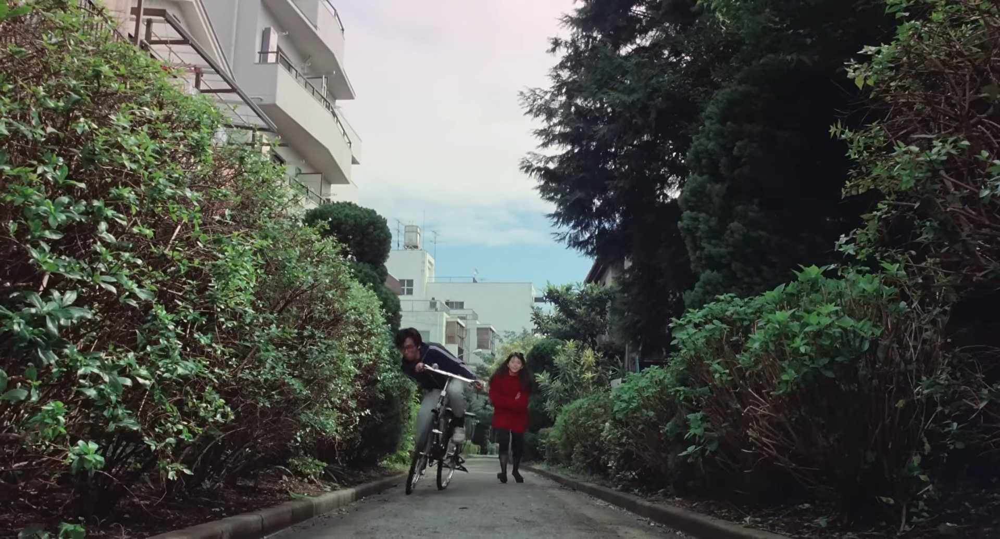

Learning how to ride a bike for the first time

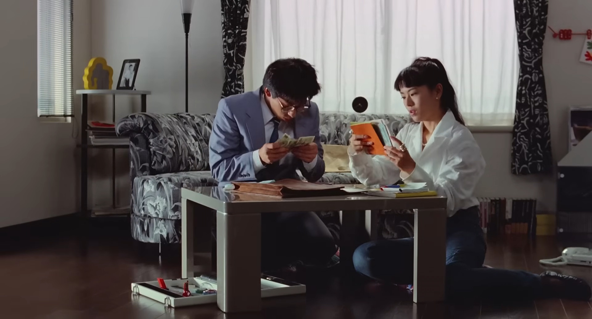

Counting their spoils

> “Let’s give it back.”
>
> “Give it back?!”
>
> “That’s right, we’re big time criminals. Chump change like this is below us! Gotta have some pride.”

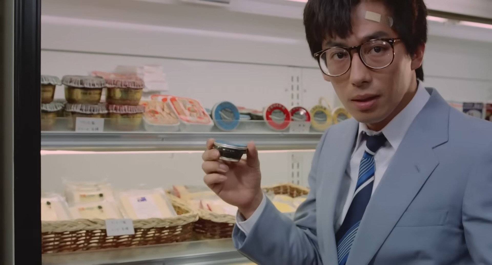

The sheepish reward for doing the right thing

2. Trying to rob a bank, but Toru hands the wrong note over and they leave with nothing. They accidentally rob Toru’s milkman instead, and return the money

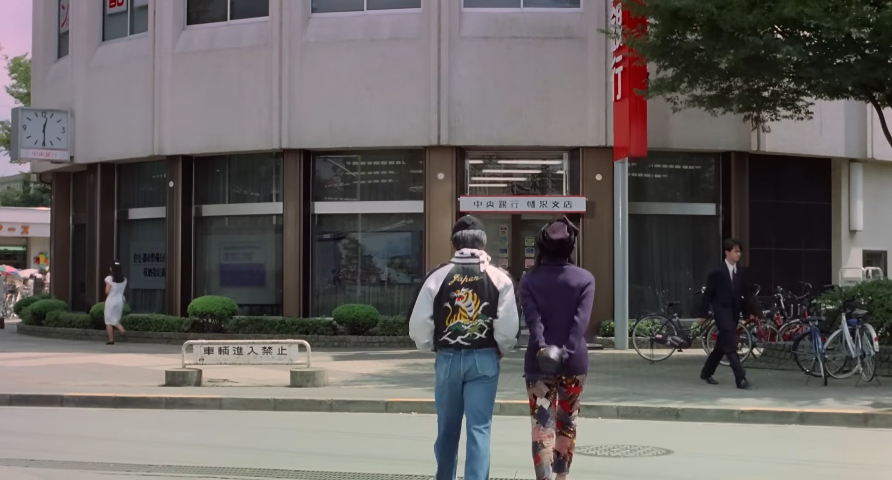

Off to the bank

> “Just act cool. Cucumber style.”

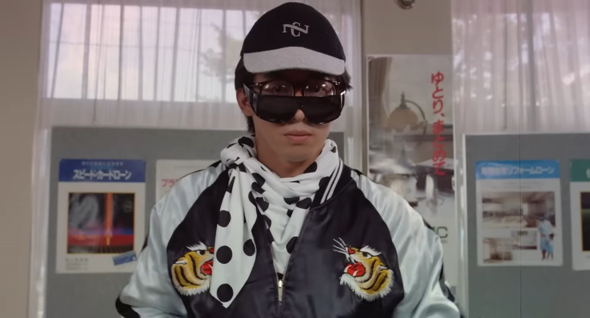

Cool. Cucumber style.

3. Trying to run a scam on a jeweler and upsell a worthless piece of jewelry. They end up buying a duplicate of the same earring instead. 

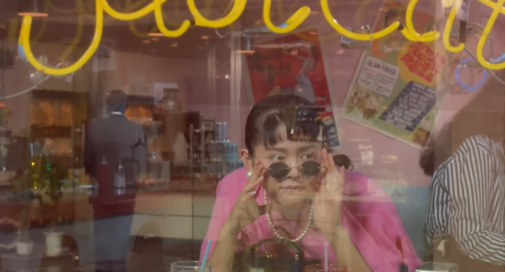

A stylish Ruby scopes out the jeweler as "Mune Kirinokoji" enters

4. Trying to rob Xanadu, a rich apartment complex. They actually manage to sneak in by copying a key, but Toru gets locked in the bathroom as the couple they’re robbing returns and has to be rescued by Ruby.

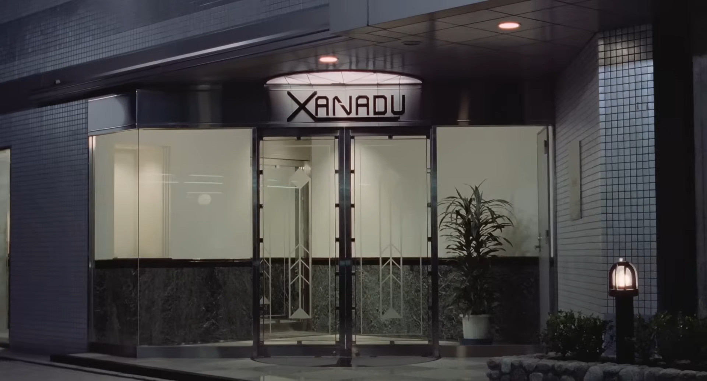

XANADU MENTION!!!

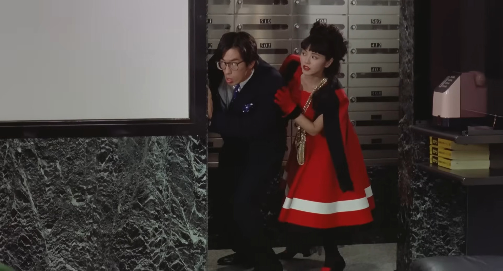

Copying a key...

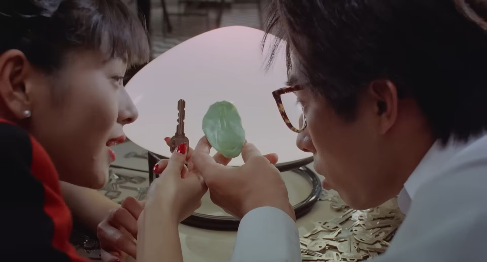

... so they can find a copy from a bag of random keys

A natural part of every burglary

5. Mail theft– Toru steals back a breakup letter that Ruby sent in a rage to her partner. It’s the first crime that they get caught for, but a kind doctor saves the day and lets Toru go.

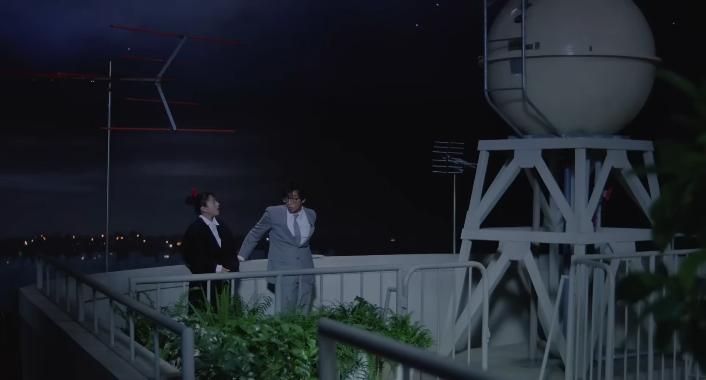

The boyfriend knows about Toru...

> “He doesn’t know I’m a criminal.”
>
>
> “Shouldn’t you be able to confide in your lover?”
>
> “Could you confess to your lover you’re a criminal?”
>
> “Aren’t relationships built on honesty?”
>
> “That’s the one thing they’re not built on!”

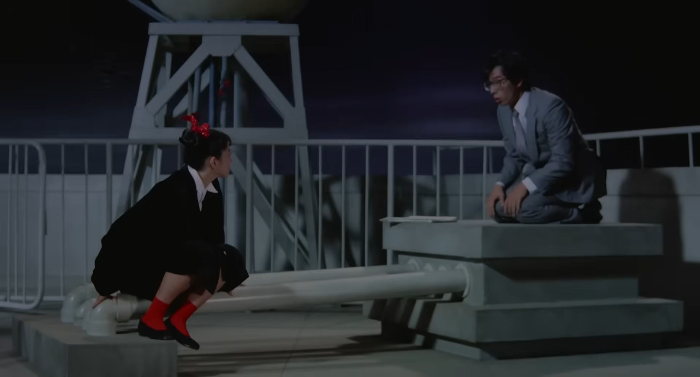

> “That’s a criminal offense! You don’t want to go up against the postal service”
>
> “This is small time compared to what we’ve been doing.”

> “You’re… how do I put this. I don’t know if you’re a fool or just a plain good guy.”

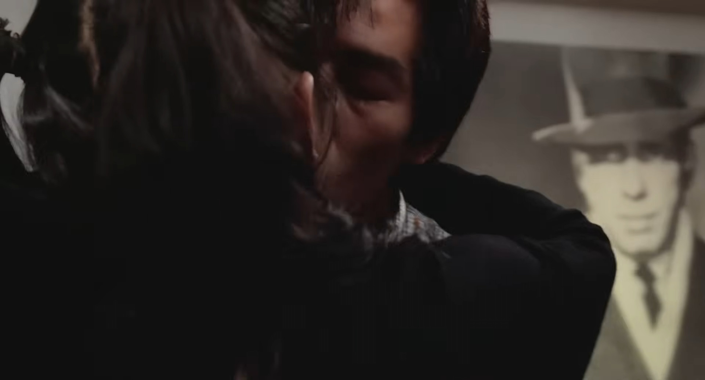

Bogart is there when they kiss, of course

Okay, my screenshotting spree is over. For now.
## beauty in mundanity
How do you identify the plot of a movie? How do you pinpoint the signs of a story successfully being told? 

*Kaitō Ruby* is a movie about nothing. Yes, it’s so clearly a rom–con from the minute Ruby and Toru meet. It doesn’t pretend to be anything else; the heists are a device to make them fall in love. But every step they take forward with their schemes is immediately undone by their comical inability to commit crime. If a movie is defined by what changes in the world, *Kaitō Ruby’s* world is glacially static.

Luckily, that’s a stupid metric to be the deciding factor of a movie’s quality. I think back to the one creative writing class I’ve taken, where I learned to look for emotional shifts as a sign that a story was progressing. This class, admittedly, focused on writing on a small scale– writing at the level of the sentence and scene. Short stories and movies don’t always map one to one, but I find this framework useful for reflecting nonetheless.

Over the course of the movie, the emotional shifts are alternately slow and sudden. Toru meets Ruby and is instantly smitten, but it isn’t until their fifth and final heist is over (with their first success) that she realizes she reciprocates. Isn’t that how life is sometimes? Emotions get pent up unobserved until they burst and fill your heart in one fell swoop. Not that the romance in this movie is realistic in any way at all, but their kiss is the payoff of all of the heists so far.

I think this is one of the most charming elements of the movie. This is a movie about nothing and revels in it. The crimes Ruby and Toru commit are foolish, with convoluted plans. They are bad criminals, and it is entertaining to watch them fail. I think a large part of this is due to the absolutely stellar casting of Ruby and Toru. Hiroyuki Sanada manages to fully encapsulate this bumbling businessman in all his naivete; he so easily slips into the role that I can see Toru as someone real. And Kyoko Koizumi’s piercing smile and classy outfits pull together such a convincing Ruby that I too was swept up in a desire to help her with her crime, if only to hear what convoluted scheme she’d next think of. Their chemistry together and the way Ruby’s playful and commanding nature completely dominates Toru’s hesitation make for delightful comedy.

## escaping routine
OK, maybe I lied about this being a movie about nothing. There is a single video essay out there about this movie, and it makes a rather excellent point![^1] This movie comes at a turning point in the industrialization of Japan. Japan had just entered an era of computers and desk jobs and a heavy push to the routine of salaryman culture. As such, the movie’s themes revolve around a break from routine, and the joy and fear that can bring. Toru is a classic salaryman and Ruby is the disruptive force that sends him spiraling into new habits; crime, as immoral as it may be and as petty as it may manifest as, breaks him from his daily routine. 

As the movie progresses, Toru becomes more comfortable and confident in his ability to commit crime. But between each scheme, Toru has a nightmare of getting caught and winding up in jail.

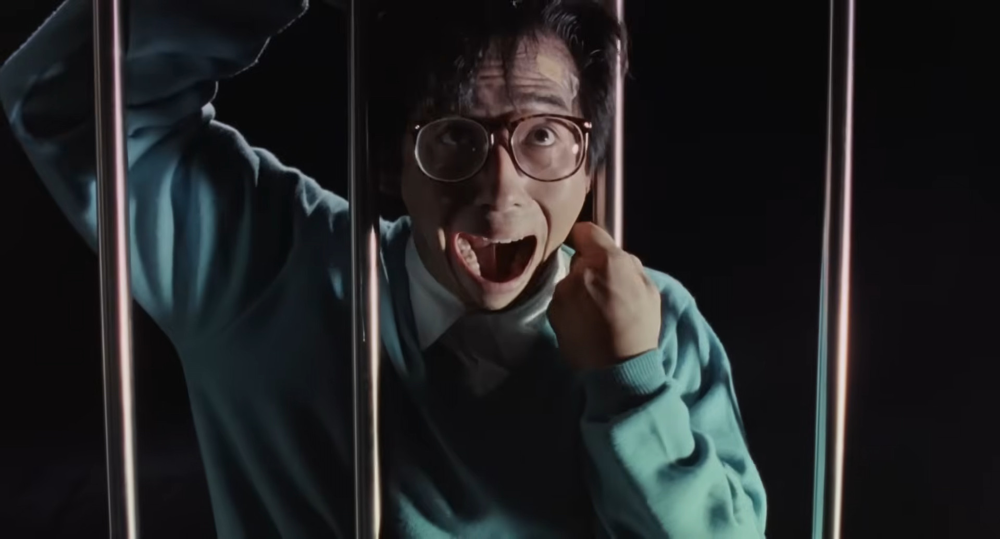

They all manifest in different ways– first he’s chased by the shadow of a giant bird, next he’s electrocuted by hooded men, then he is chased by a masked man with a cartoonish gun. Each successive dream highlights not only his fears but also his growth. After his first nightmare, his mother comes into his room to check on him and calm him down. But by his last one he’s alone. His mother is no longer concerned with him, the boy has grown up.

Ruby too escapes her routine. She has, until now, kept her love and her life of crime separate. It’s scary to let someone else know your true self
## the wonders of life
Above all, I think what this movie does best is turn the everyday into the magical. And isn’t that the case when you’re in love? Without even knowing it, the little moments become monumental. Trying caviar for the first time. Staying out too late drinking beers and skipping dinner. Sneaking glances at a photo of your crush (although Toru is inexcusably a lech while doing so).

And these moments litter the movie with shots as gorgeous as they are comedic. Take the sunset before the day of their first crime.

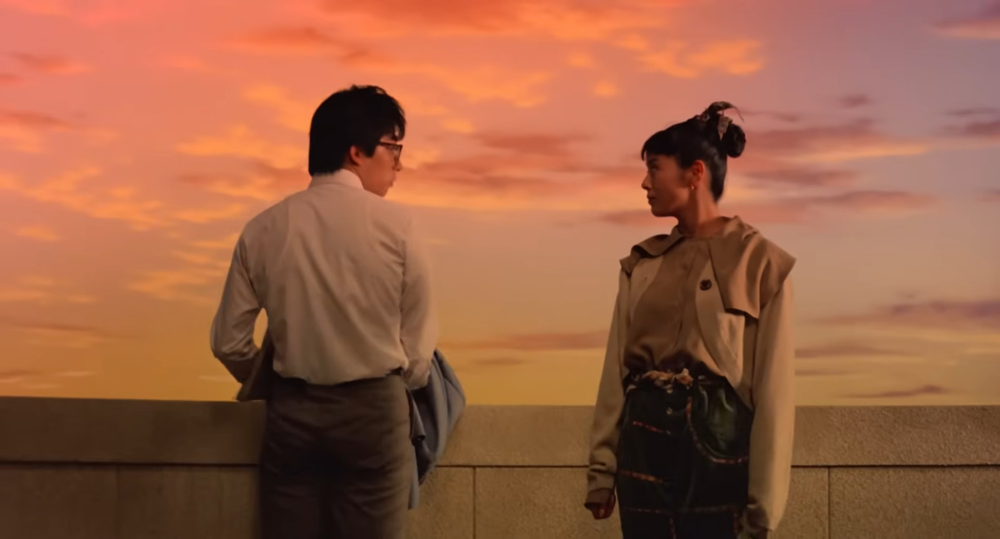
And the musical segment! How many movies have a diegetic song and dance? This was such a swift, natural step into song– Ruby is on the phone with her boyfriend as an English song begins to play on the radio: 

> They say the world is a stage
> 
> And destiny must be a great playwright
>
> You live a script page by page
>
> And sometime you're picked up by a spot light

As soon as Ruby hangs up the phone she starts to hum and sing along to the tune, and our two leads are basked in a soft spotlight. Give it a watch if you can, it’s a stunning sequence.

<iframe src="https://www.youtube.com/embed/7rapIpPPVJo" title="Kyoko Koizumi &amp; Hiroyuki Sanada - Tatoeba Forever - Kaito Ruby ost. - 快盗ルビイ" frameborder="0" allow="accelerometer; autoplay; clipboard-write; encrypted-media; gyroscope; picture-in-picture; web-share" referrerpolicy="strict-origin-when-cross-origin" allowfullscreen></iframe>

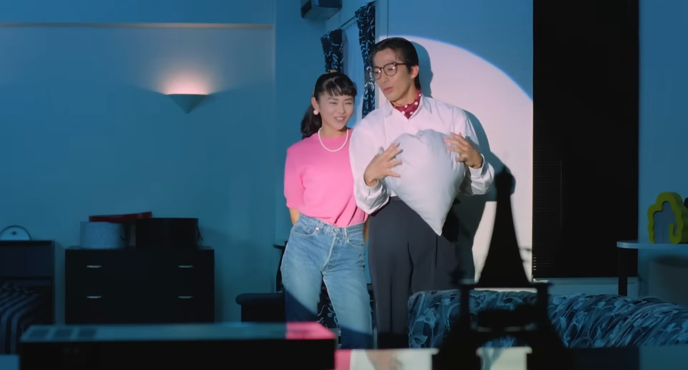 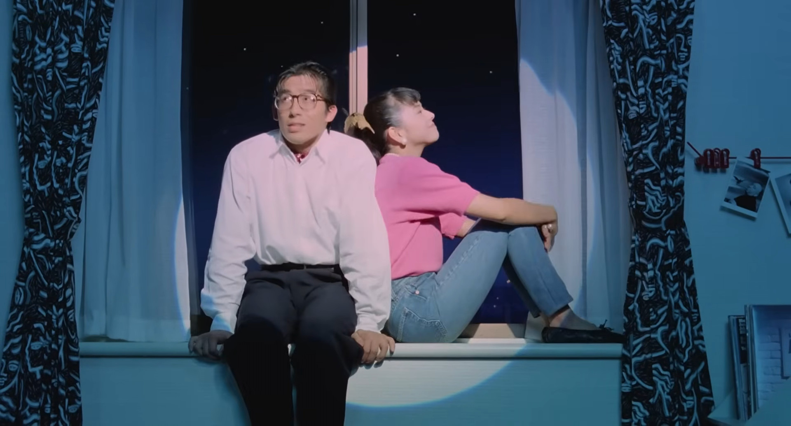

## endnote and more
I started writing this post weeks ago and hit a writing dry spell. I’ve finished it up as best as I could, but it’s a new month and my voice from then is gone. There are things missing from here, of course, but if you want to know more just reach out and ask me about it. 

That being said, is Kaitō Ruby the best movie in the world? No, probably not, and you’d be hard pressed to make a solid argument for that. Hell, most of the people I was watching the movie with were bored and thought it was poorly paced. But that didn’t stop me from thoroughly enjoying it. I need more movies like this, that tell a story slowly and tell it well.

[^1]: The essay can be found [here](https://www.youtube.com/watch?v=hI_YPRPebPY). It is in Portugese by Claquete de Papel, and I love its perspective on the movie! Please don’t let YouTube autodub it, their voice is so pretty and energetic.
