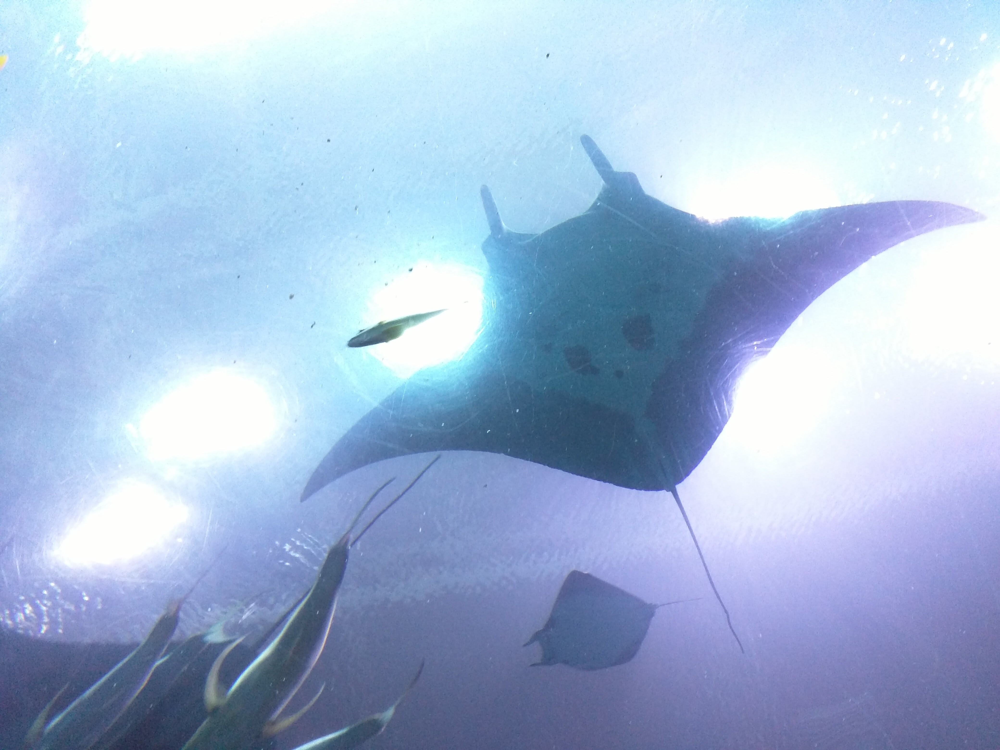
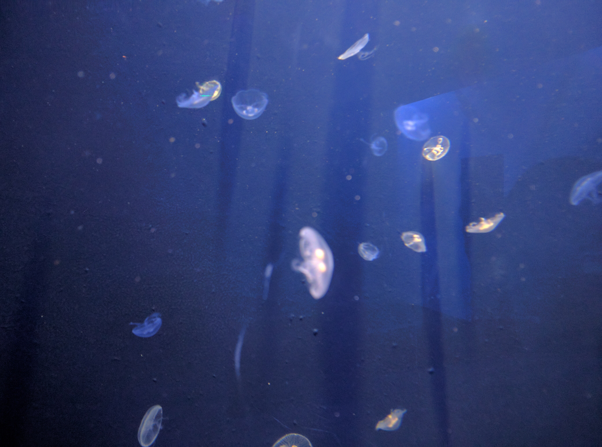
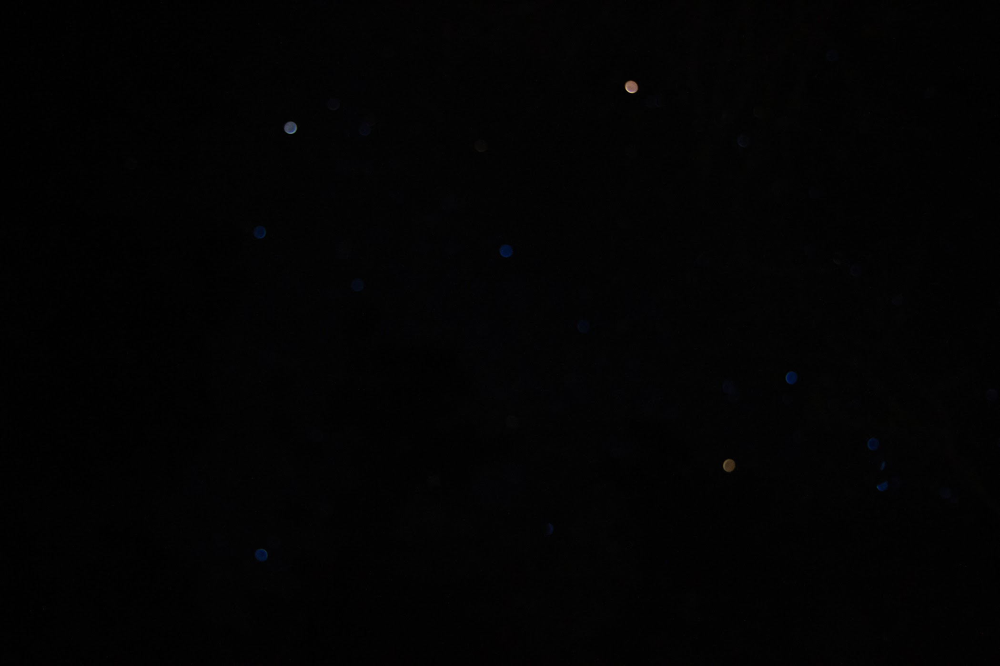

A common icebreaker tossed around asks about your favorite color[^1]. As an incredibly indecisive person, I struggle tremendously with this question. 

What do I answer? 

Do I go with orange? Lavender? Two colors that resonate with me deeply, one that reminds of foxes and one of flowers I so dearly enjoy. Do I go with blue or green , simply because my wardrobe has settled into an overwhelmingly blue-green dominant palette? Or do I go with the brilliant bluish-green keppel, a color I found when I was browsing a Wikipedia article on shades of cyan[^2], a color I fell in love with because it pleased my mouth to roll it around like an Icebreaker coolly melting on my tongue[^3]?

Well, picking favorites is stupid, I say, and not just because I have a hard time with it. 

My favorite color isn't something that can be defined by a vague descriptive word. I can't just pick a hex code either, because I don't see the world in hexadecimal! My favorite color has to be one I've seen before, it has to be a color I've experienced personally.

Even if I could just choose one, my favorite color would still be tied to a specific moment, a specific memory. How could I capture the world as I saw it in a single word, in just a single *name* for a color? I'm not nearly a good enough writer for that.

So here, while I'm still thinking about it, let me give you the stories behind some of my favorite hues, with an occasional picture here or there to put you one step closer to my mind[^4].

----
### orange

My favorite orange[^5] happened on March 19th, 2023, around 6:30 AM. The whole world was on fire that morning when I woke up; the warmth of the light that fell upon my shoulders as I zipped open the door of our little orange tent transported me into a world beyond our reality. 

As I stepped into this waking dream I saw the world anew, and the Spanish moss hanging from the branches nearby was actually the braided locks of a dwarf's beard mid-laugh, the horizon was a blue bowl filling up with the cosmic soup of sunlight, and I could almost see the wind itself glowing golden under the wings of birds as they soared high above me, swimming in the sunlight.

It was the first sunrise of this camping trip, and it felt like a good omen to start on. This was a trip with orange littered everywhere-- our tent, the fire, my shirt, the sun. I know a lot of people find sunrise a magical moment. But this was the first time I understood what they meant.

----
### brown

All colors kind of feed into each other if you think about. I think brown is kind of like a burnt orange sometimes. 

But despite everyone who loves orange, I don't know if brown is a color many people call their favorite. 

It's easy to miss brown in the world, to skip it over in day-to-day life, to take it for granted and move on. But brown is everywhere-- chocolate, cats, and caramel, paper bags, peanut butter, and pie crusts, horses, hair, and hiking boots, owls, envelopes, and eyes. It's the color of childhood, of playing outside with your friends in the woods behind your home and coming back at sunset with clothes that in their messy grime speak of an evening well-enjoyed. It's the scalding warmth of a brown sugar cinnamon Pop-Tart on my tongue as I go for a bite because I've microwaved it for too long.  It's the comforting roughness I feel when I lean against a tree in the woods to pull out a branch caught between my shoelaces, knowing the aged oak will gladly support my weight. 

The same camping trip that gave me my favorite orange gifted me my favorite brown, too. This one comes from a shot I took while running through the woods, trying to race ahead of my friends to get a picture of them as *they* hiked.

It's a moment with a lot of brown in it. The trees were a maze, tall and proud, that cast deep brown shadows on the forest floor, which was a potpourri of brown of all kinds, sharp and soft and dry and dark. What stood out to me most was my hair, its curly ends bleached into golden-brown strands, as it caught the evening sunlight in stride[^6].

----
### grey

I think grey is another color that nobody really thinks of. For me, grey is the color of brutalism, of concrete, of sidewalks and skyscrapers. Of pigeons that flit by my eyes and raccoons that stalk the trash cans at night during my walk home, the color of the past and locked-away memories. And of course, it is the color of MAERSK containers on the road, which is where *my* favorite grey lies. 

As a child, I used to be obsessed with MAERSK. All I really knew was that they were a shipping company, and that was more than enough for me. Seeing their containers would bring me joy whenever our car passed them on the road.

There was a series of LEGO sets released in collaboration with MAERSK. I remember really really *really* wanting the LEGO Creator MAERSK Line Triple-E ship. It was *the* MAERSK cargo ship with dozens upon dozens of little cargo containers, each a MAERSK grey with the little stickers with the logo outlined in their iconic MAERSK blue. The ship could be displayed on a pedestal with a little black label describing it's specs. I would see it in the monthly LEGO magazine that was delivered to our home and dream of one day putting it up on display.

I used to save up my money for LEGO sets back then, and the MAERSK ship always tempted me. But my desire to purchase the Tower Bridge won out, and after buying and building that beige behemoth I slowly moved on from the grey MAERSK containers. They'd faded entirely from my memory until this past year, when I saw a stray container in a lot by the road. 

Color is a kind of memory too. Seeing it took me back to my childhood, and I stood almost transfixed as I remembered the little joy that seeing that steely grey used to bring me. 

----
### blue

I think blue is the hardest color for me to pinpoint a shade of. There's the aforementioned keppel, of course. There's the sea-blue palette that my wardrobe leans into. There's the iconic MAERSK blue, which was almost certainly my favorite for a period of time in the past.

But I think the dappled blue of the Georgia Aquarium wins out in the end. Of all the Atlanta attractions, it's the only one I've visited more than once. If I open up my Google Photos albums, my oldest aquarium picture dates back to 2017, back when my maternal grandparents were visiting us in the US. We took a trip there before heading to Jekyll Island by the coast. I think it was my first time at the aquarium since elementary school, and I took pictures of the mantas as they floated above us and the jellyfish as they ambled about.

The blue you find there isn't just a color, it's an entire spectrum. It's purplish in some rooms, navy in others. It pulses because it's life itself. I'm lucky to live next to one of the largest aquariums in the world. This is an aquarium people will travel to Atlanta for, and it's filled with blues I take for granted because I can just walk over there and do homework whenever I feel like it!

My favorite spot in the aquarium is right by the entrance to Ocean Voyager, the whale shark room. At the start of the first hallway is a circle shaped window about knee-height off the floor that's just about large enough for me to sit in. I'd get to the aquarium right as they opened sometimes just so I could claim the spot, just so I could curl up in there, one side of my body pressed flush against the tank as if I was trying to phase through the glass and enter the murky water. I'd sit there for an hour or two at a time, typing away on my laptop until it died, usually getting distracted by the fish that would swim right by me.

From my perch I'd see the school groups come and go in waves. I'd see tourists standing by the entrance look long and hard at their maps before dispersing across the aquarium. I'd spot children racing ahead of their parents, who struggled to roll their strollers behind their toddler's chaotic path. And I'd see everyone, no matter who, taking pictures, pictures tinted aquarium blue. I'd sit there in the me-sized nook and I'd wonder about their stories. Why were they here? Where were they from? How was their experience? I would sit under the dreamy blue and let my mind wander. If you're ever in the aquarium, you should sit there too.

----
### red

My favorite pinkish-red is from the shaky, out-of-focus pictures I took with my phone camera the night of May 10th, 2024. A trip with former friends, back when solar phenomena were popping up everywhere you could imagine. We went aurora chasing after we saw a pink glow lingering in the sky past sunset, hopping into a car the minute we finished microwaving a plateful of dino nuggets for the road. We drove to the nearest dark site we knew of, our red car a flash of muted color on the highway as we desperately chased the setting skies. Parking at the base of Arabia mountain, we ignored the 'park closed' signs that we couldn't read in the dark and climbed, practically ran, up the mountain just so we could sprawl on the rocks at the top, so we could sit in the light breeze and try to commit to memory the final breath of solar beauty before it disappeared for the night.

We saw nothing, of course, nothing with our eyes; we'd lost sight of the aurora long before our drive had ended. But it was the journey that made it special. I hadn't dressed properly for the cold, my 7D didn't have in-body stabilization and my shivering knees were hardly a replacement for a tripod so my pictures were a hot mess. I pulled out my phone to take *something* to capture the moment.

We stayed at the top of the mountain for a bit, maybe thirty minutes or so. We were already there, we might as well enjoy the view. And then we ambled down the mountain and drove back home.

That pink I didn't quite manage to see is still softly seared in my mind. At least for now, until a newer pink takes its place.

----
### green

Green is the color of my imagination, and so I thought it would be hard to pick a single shade. But I think this was the easiest, I think this was my first favorite color.

I don't get to visit India much anymore; flights there are expensive, and the breaks scheduled into college aren't long enough for international travel. But back in high school, I would go every summer. We'd bring with us chocolate and candies and the rain; the first two were gifts for just our family, the latter a gift for everyone.

I don't know if you've ever been to India during the monsoon season, but when the clouds are done with their business, the rain lingers on the leaves like nowhere else. My favorite green is the green that clings onto the leaves after the monsoon when the air is filled with petrichor and  drained clouds hang in the skies.

There's something special about walking in the streets then, it's vibrant in every direction and the leaves sparkle. The streets there are usually filled with a medley of grey and beige and brown and red, a weird blend of earthy & industrial depending on what street you're on. But when it rains, all the other colors seem to fade into the background and you're almost blinded by the emerald glow hanging all around.

Color can be a link to the past, too. This is a picture of the playground by the primary school my mother attended. How long has this green lived there? How long ago, before my mother, did it arrive? And how long after will it last? How hard has it fought to keep its roots in the ground? When I stand in front of this playground it's almost as if the trees are playing too, playing at a tree's pace, playing so quietly you have to slow down to join in.

My favorite green is the monsoon green that dozes on the leaves after the rain in India. It was my first favorite color.

----
### black

I guess I'll close with black. A fitting place to stop, I think. My favorite black comes from a trip to the Okefenokee.

The Okefenokee is a peat swamp straddling the southern border of Georgia. It's one of the only swamps in the country, and was designated a National Natural Landmark in 1974. We were there to canoe camp, and our activity for the weekend involved canoeing six miles to a floating platform named Monkey Lake, where we'd spend the night in the swamp, disconnected from the rest of the world.

From the start, this was a trip of greys and greens. Canoeing the swamp felt like traversing an aquatic grave. Everything was silent and slow; dark-green alligators were lazily brumating in every direction we looked. Black turkey vultures swarmed on naked branches above us, breaking the monotony of steely grey skies. The water was a deep, dark, blackish-blue. But my favorite black[^7] wasn't the swamp water or the vultures or even the watching eyes of the alligators as we passed them. It was the starry night sky on January 20th, 2023, the night before we entered the swamp.

It was the night before a new moon and our campsite was blanketed by soft starlight. Even though we'd hit the road as soon as our classes had ended, it was a long drive and we only arrived at our campsite as sunset began. There were three of us there (our fourth was still en-route) and we were fighting the darkness to set up our tent and start a fire for dinner.

After we were settled and had scarfed down our campfire grilled sandwiches, a friend and I ran out with our cameras to try some astrophotography. While I was packing for the trip I'd scrawled down the right shutter speed and ISO for a starry sky in my pocket notebook, which I pulled out now to guide us. Reading my notes via the light of a finicky headlamp, we fiddled with the dials on our cameras and aimed at the skies.

I took a shot and realized I wasn't even focused on the stars. After a bit of finicking I'd gotten my settings down and was getting some workable pictures[^8]. I turned to look at my friend but she was struggling; her pictures were all black. We double-, triple-checked her settings, and everything looked normal.

And then I laughed a booming laugh when I realized my friend had forgotten to take her lens cap off. Such a simple mistake, such a simple memory.

Those pictures of the night sky (ones that I never saw, because they were deleted almost immediately) might be my favorite black. There doesn't always need to be some grand beauty behind a favorite color. There isn't always a reason for the things you feel.

----
### a point

I don't know if there's a point to all of these words. What started with a single stray thought about the way the leaves look in India turned into something longer. But I do think it's a fun exercise to sit down and think about your favorite color. It's certainly given me a more interesting list of answers to what is possibly the most banal question in the universe.

The next time someone asks you for your favorite color, don't just answer what, but also from when. From who. From where. It'll almost certainly lead to a better conversation[^9].

----

[^1]: I've tried to render, where I can, an approximation of each color as it is mentioned.

[^2]: I was pretty sure I was browsing this page because I was musing about the color distribution of my clothes & trying to pick a favorite color. But then I went to find the page again to get a clearer look at keppel and realized I really truly do not remember why I was on it. It is a lovely corner of Wikipedia though.

[^3]: This is a construction I find myself using a lot in my writing. Something about imagining the taste (really the texture) of words in my mouth as I say them is interesting; I'll be writing about this at some point.

[^4]: And because choosing even just one color is hard enough, I've trailed into the footnotes for even more of my memories. I was going to write these footnotes for every color, but it was getting hard. Maybe one day I'll come back and update this article.

[^5]: Yes, it's the orange of sunrise that one morning, not the amber promised in the future of the unripe mangos I've just picked from our garden's tree in India, although that was certainly a close second because of its cloyingly sweet homegrown taste; not the color of the Great Smoky Mountains in autumn, even if they were like a fire in their own way, because it wasn't just the orange that made the moment special then, it was the flamboyant reds and golden yellows too; not the orange of the pumpkin I carved last fall when visiting a friend in Jersey, not even the way it weakly lit up from within its belly when we put a Diwali candle inside; and no, not even the ruff-ish orange of the deer I locked eyes & conversed with on a walk at Roosevelt Island last autumn, because that was less about the color of the moment than it was a connection with nature.

[^6]: I don't have a lot of pictures of me in general, and even fewer that I'm happy with. But this is a picture I adore. I hope you can figure out why this is my favorite brown. I wanted to put it in words but I'd run out of them.

[^7]: This was a tough one, because there are so many moments with black that mean special emotions to me! The eclipse, the Great American Eclipse of 2017, where my family and I drove up to South Carolina with telescope in tow to catch the eclipse in totality was a magical experience; the world went dark for a minute and I was chilled to my core! And going even further back in my memories, there's the overpowering smell of black bitumen and plastic melting together in my mind from when we made a little segment of poly-road for the Muktangan Exploratory centre's inter-school science fair; the bitumen sparkled like little black gems as we broke it down with a hammer to prepare it for melting.

[^8]: But the workable pictures weren't as good as this first fuzzy unfocused one. I have thoughts on "shitty photography," ones I'll put to paper soon enough.

[^9]: Maybe. I make no promises.
