I graduated. I had my [grad party](/blog/deer-in-headlights). And two days after my graduation ceremony I turned in my final copy of my thesis to my advisor. Lest I spoil any of its contents, I’m putting the text here first before I reflect on it. It’s a style of writing you probably won’t find on this blog again any time soon. So read on, experience the culmination of my degree, and enjoy learning about paper in the Papermaking Museum’s archive. 
## Downstream from Dard Hunter: A Material Exploration of the Book Harmonious

### Introduction

On an average day at work at the Papermaking Museum, I shepherd elementary schoolers through the papermaking process. The education coordinator helps kids pull paper pulp onto their deckle and molds, lets the water gently drip out the sides, and shop-vacs whatever water she can from the mold, a trick borrowed from industrial papermaking. She hands it over to me, and I flip over the mold and plop it pulp-side-down onto a sheet of blotter paper. Blotters are like reusable paper towels; they eagerly absorb excess moisture from the pulp. With some help, the kids squeeze out any excess water and couch their not-yet-paper onto a fresh, dry blotter. I hand them another blotter, and they transfer their blotter-paper-sandwich to the next available iron, where electricity evaporates out whatever water is left.

Sometimes I am in charge of the ironing station, sometimes the pulping, and sometimes the couching—my place in the rotation isn't fixed. But the activity is, the material we use is always the same. We use a mixture of cotton, a fiber everyone knows, and abaca[^1], which nobody ever knows. The cotton has been beaten three hours and the abaca for five[^2], they are two to three millimeters long each. The pulp uses a nine parts to one ratio of water to fiber. In the pulp are scattered decorative pieces of material known as inclusions. Usually, these inclusions are shredded bits of money, colorful like confetti, which is always a fun surprise to reveal to the children at the very end. Sometimes, the leftover pulp from the museum's adult workshops is mixed into the children's batch and the inclusions mix. Most recently were lavender seeds, which sent their gentle smell tumbling through the air as the paper was pulled.

In my eyes, this is what the Papermaking Museum is and does, because for five hours a week I show up, teach children about paper, and leave. But we are a museum too, with a permanent gallery and rotating exhibits, and we have a massive archive. In its own words, the Robert C. Williams Museum of Papermaking is “the most comprehensive collection of paper and paper-related artifacts in the world." Comprised of over 100,000 artefacts spanning handmade papers, rare books, and prints, it is devoted to preserving the history and art of papermaking.

As you might expect, a large portion of the collection is paper. Fine and fancy handmade papers from across the globe featuring traditional papermaking techniques from Southeast Asia. Contemporary artist paper. Hundreds of greetings printed on handmade paper, boxes of Chinese paper cuttings, and watermarks from different mills and makers. These papers are artefacts defined by their material, given value by their very existence. I’ll talk about paper and what that actually is soon enough, but I’d like to give a quick introduction to the key players of this story first. There is the museum itself, the Robert C. Williams Museum of Papermaking. There is Dard Hunter, prolific papermaker whose collection in pursuit of “the book harmonious" was the seed for the museum. There is Irving H. Isenberg, professor at the Institute of Paper Chemistry, who started the Fibrary, a library of plant fibers used in papermaking. Then there are the Houghs, a family whose multigenerational project, Hough’s American Woods, is an artefact that records the twentieth century forests of America. And then of course there is us, in the twenty-first century, with a fundamentally different relationship to paper and pulp arts and sciences than Hunter, Hough, or Isenberg. We are players too, because we have transformed the meaning of their collections into something new entirely.

If we ignore the meaning of their work in the Museum's collections for a second and focus on the _material_ itself, what stories can we uncover? Dard Hunter’s books, the Fibrary, and _The American Woods_—artefacts made of distinctly unique material—are the stars of this story. Let me trace back the provenance of these artefacts; let me recount the meandering path they took to reach us in the present day, and what they have to say. I promise it's an interesting tale. I’ll begin with Dard Hunter, the magician’s assistant whose collection started the museum.

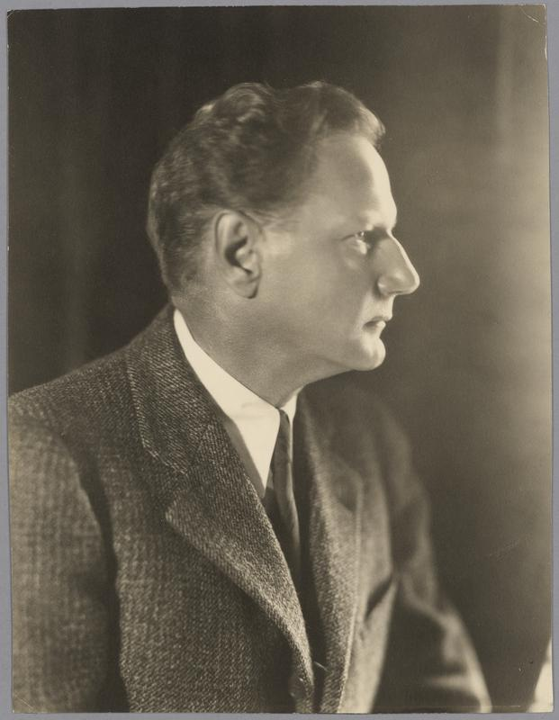

 Figure 1: Dard Hunter 

### Dard Hunter’s Labors

William Joseph ‘Dard' Hunter (1883-1966) was an American papermaker from Steubenville, Ohio. Born to a family that ran the local daily newspaper the Steubenville _Gazette,_ he was immersed in the world of printing since childhood. Throughout his autobiography, Hunter bemoans industrialization and how the world has changed since the gasoline revolution. Wishing he was born in eighteenth century Scotland, he proclaims:

> “The machine age has unfolded before my eyes, a prosaic period that has not appealed to me. I have long been an advocate of hand craftsmanship and have struggled against mass-production methods…” (My Life With Paper, 3)

True to his word, he spent his life obsessed with hand papermaking. For his book _Old Papermaking,_ he produced all aspects of the book on his own— he wrote the text, made the paper, designed and cut the typeface from scratch, typeset the book, and printed and bound the whole deal. A plaque in the Smithsonian hanging above an exhibit of his work proudly read that “in the entire history of printing, these are the first books to have been made in their entirety by the labors of one man.”

The younger of two children, Dard and his brother Philip (Phil) were born to Harriet Rosemond and William Henry Hunter. Both boys grew up helping their parents write copy for the _Gazette_ and set the type by hand. Hunter was also in charge of taking care of his family’s chickens and horses and began to dabble in pottery. Right before the Spanish-American War, Dard and Phil traveled to Pittsburgh to see a performance of Herrmann the magician. This was Phil’s moment of inspiration, and he set out to become a prestidigitator, applying his brilliance towards creating magic tricks. He quickly grew famous under the moniker “Phil Hunter, The Wizard,” and by the age of eighteen was a professional magician. He began to tour the northern states with Dard as his assistant. After two years of travel, the pair were making around a thousand dollars a week.  

By this point, Hunter had developed his own act for the stage, a “chalk talk” where he would spend about fifteen minutes delivering a comedic set while drawing pictures with colored chalk. Phil’s health was quickly declining, however, and he left the magician circuit to be treated for tuberculosis. Dard continued managing the act for a short time, traveling with different magicians for short spurts of time, but grew bored of the stage. He returned home and began producing chalk-plate cartoons and graphics for the newspaper with his artistic skills. Around this time, he was gifted a book by his father printed by William Morris[^3], a leading figure in the British Arts and Crafts movement. His fascination with the book along with some parental persuasion convinced him to attend college. In 1900, he began attending the Ohio State University with a dream of visiting England and the Kelmscott Press. His brother introduced him to _The Philistine,_ a magazine edited by Elbert Hubbard, bound in butcher paper. It was produced at the Roycroft Shop in East Aurora, New York, and Dard was immediately hooked.

The Hubbards and the craft community they began at Roycroft were the American counterparts to Morris in the Arts and Craft movement. Dard wrote to them asking if he could work at the press post-graduation, but was met with a mixed response. Upon the Roycrofters appeal, he spent the summer of 1903 in East Aurora. As his vacation ended, Mr. Hubbard asked him to continue living at the Roycroft Inn and work for a weekly salary, and Dard quit school to pursue his art. Here, he learned how to make glass windows and developed his skills in art, bookbinding, and printmaking. But he still yearned to travel to Europe, and after marrying Miss Helen Edith Cornell in 1908, the newlyweds left for Vienna. Dard had always dreamed of studying at K. K. Graphische Lehr- und Versuchsanstalt, the Austrian printing school, but was warned he would be denied admission. The school required an industrial diploma granted by their governments. America had no printmaking schools, and he felt this rule was “discrimination against [him] as an American.” So, naturally, he invented an imaginary school and forged a diploma to be admitted.

He honed his printmaking skills in Vienna and learned the latest graphic styles. Combined with his experience at Roycroft, Hunter was skilled enough to find work in London as a commercial designer. He moved up there with his wife in 1911 and visited the London Science Museum for the first time. Here was his introduction to hand papermaking.

From what I can tell, no pictures remain of the exhibit, the early history of the museum isn't well recorded[^4]. But I can imagine what it looked like. Mould and deckles on display of various sizes, samples of handmade paper pinned up beside them. Paper gently illuminated from behind so you could see the silhouette of their watermarks. Sets of punches and matrices for type. This was century-old technology, obsolete even before Hunter's birth, strung up to be cherished. This was the perfect craft; it appealed to his Luddite sensibilities. A laborious task wherein every sheet of paper was pulled by a person? A craft where the hand labor was not forgotten, instead celebrated? Where every letter was made and placed by hand? He returned to the museum almost daily to study the exhibit, and quickly grew to think that “buying paper from a paper mill left too many of the vital steps of making books in the hands of disinterested workmen”. And so the magician’s assistant began his lifelong obsession with handmade paper.  

### An interlude about paper

I think it is important to talk about paper and what it is. _Paper_ is a very specific term describing a very specific output of a material production process. The spiel I give when leading papermaking workshops at the museum dictates that for a material to be considered paper, three things must be true.

First, it must be made out of a plant material. It can be any plant—it can be abaca, cotton, kozo, or kudzu, but it must be a plant. Second, the process must involve water. Third, the plant materials must be pulped together, whether mechanically or chemically. Pulping refers to mashing down the plant into fine, smaller fibers, usually with a machine known as a Hollander beater. These rules define what paper is. Everything else is mimicry, a steppingstone material practice in the path towards true paper. Barkcloth, banana/palm leaf paper, papyrus, parchment, and vellum are all fake papers, some more obviously than others. This strict definition of paper as a pulp product seems to be the universal definition. I don’t know where it arose from, but this process is what Hunter fell in love with.

In 1913, Dard and Helen returned to America. At the time, there were no hand-papermaking mills in the country and artists relied on European imports. Hunter was prepared to “make books by hand completely by [his] own labor—paper, type, printing,” and bought an old house by Marlborough-on-Hudson, Ulster County, New York. This historic house sat on a forty-acre fruit farm replete with trees and a stream. Hunter slowly refashioned the site into a paper mill. Sticking true to his principles of traditional papermaking, he ensured the mill was exclusively powered by a water wheel on the nearby creek. Hunter began a four-year journey to cut 63 type punches by hand to cast his own font for printing[^5]. After some failed experiments with bookprinting, Hunter published a 200 copy limited edition of his first book, _Old Papermaking_, in 1923. Due to its unexpected success, he published a follow-up, _The Literature of Papermaking,_ in 1925. Both books focused predominantly on early European papermaking– processes that produced paper that fits the bill for the definition we decided on earlier. We'll come back to his early books in a short while. Hoping to compile a comprehensive account of non-European papers, Dard sailed out from San Francisco in 1926 to explore the papermaking of the Pacific Islands. This next decade was filled with global travel, where Hunter used his wealth to travel Asia and accrue his collection of papermaking material.

### The Dard Hunter Paper Museum

In 1936, Dard Hunter received a letter from Dr. Karl Taylor Compton, prolific bibliophile and President of the Massachusetts Institute of Technology. Dr. Compton was a frequent patron of Dard’s publications and proposed that he open a museum of papermaking on M.I.T.’s campus. After a brief courting period, Dr. Compton was able to secure a ten-year contract with a $5000 annual salary for Dard, and the Dard Hunter Paper Museum finally opened at M.I.T. in the summer of 1939.

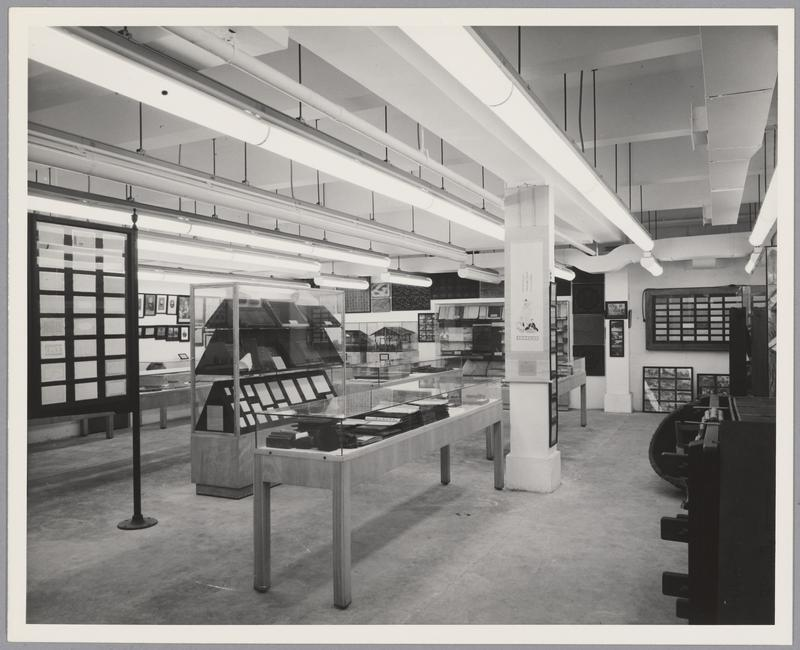

 Figure 2: Dard Hunter Paper Museum 

Over fifty crates were packed and shipped over to the museum in 1938, insured for over $25,000 dollars. Although primarily a hand-papermaking museum, Hunter felt it was important to sample high-quality machine paper too. He reached out to major American mills who gladly obliged with samples of books and fine papers. But overwhelmingly the museum featured artefacts from Hunter's global travels, highlighting samples of diverse papermaking techniques. Rows upon rows of cleanly organized display cases contained framed paper samples, papermaking tools, prints and their respective woodblocks. The windows were “arranged in the Japanese manner,” featuring elaborately crafted watermarks help up to light. Exhibit cases featured scale-models of primitive paper mills across Asia.

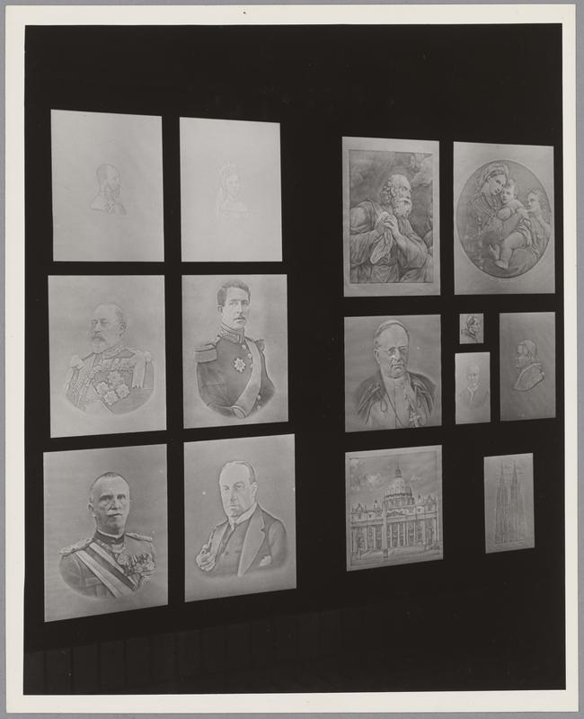

 Figure 3: Watermarks in the "Japanese Manner" 

Opening to a large success, the museum had visitors who traveled to Cambridge exclusively for its exhibit. Hunter would infrequently receive letters praising his collection for its quality. As time went on,

> “The museum was frequently visited by groups of interested professors and students from Harvard, Simmons, Wellesley, Boston University, and by members of paper and printing societies, and teachers and students from art schools. For the most part, however, the faculty and students of M.I.T. were apparently unable to grasp the significance of the collection. They probably thought that the museum had little to offer in highly developed scientific study. What the scientific-minded M.I.T. professors and students failed to realize, however, was that the origin and development of papermaking as shown in the museum was the basis of all civilization, and that had it not been for this craft the world would have been totally unable to exist. Without paper there would have been no scientists!”

While Hunter grew more disillusioned with M.I.T.’s approach to his museum, M.I.T. grew tired too. When Dr. Compton retired, Hunter lost his biggest supporter at the Institute, and the school quickly began trying to relocate Hunter and his collection. By 1948, Dard's ten-year contract had expired. The new president of M.I.T., President Killian, decided that Hunter had to retire by June 1949 as he was past M.I.T.'s mandatory retirement age of 65. The museum would also be moved into the much smaller Hayden Library on campus, where it became an obscure footnote on campus. Hunter would be kept on as an honorary curator with the same $5000 stipend until he turned 70. He would have to work on finding a new home for the institute, because by then M.I.T. could not pay him any longer.

In 1954, John Strange, the Vice President and Treasurer of the Institute of Paper Chemistry reached out to Dard Hunter. He wanted to see if Hunter was interested in moving his collection to Appleton, Wisconsin. The Institute offered M.I.T. $16,400. Hunter felt it was a natural place for his collection, but M.I.T. thought the offer too low. They reached out to other schools in vain, including Yale, Harvard, Princeton, Georgia Tech, and Columbia, but nobody had the space or money to support Hunter's salary. Begrudgingly, M.I.T. accepted the offer by the end of July, and the new Dard Hunter Paper Museum in Appleton opened early 1955. Hunter remained the curator until his death in 1966.
### The Institute of Paper Chemistry

There is one more piece of pure exposition important to this story: the history of the Institute of Paper Chemistry (IPC). Conceived in 1915 as an idea by Samuel Plantz (then president of Lawrence University), it became real over a decade later when Dr. Henry Wriston (president of Lawrence University from 1925-37) organized a partnership between Lawrence University and the papermaking industry in Appleton, Wisconsin. Initially founded to educate young boys to enter the logging industry, it pivoted into a graduate program for students in pulp and paper. Opening its doors to an inaugural class of ten students in 1929, the IPC had no formal building and taught out of a gymnasium.  

Appleton is located in the Fox River Valley, a land that has passed through many hands. Initially peopled by the Winnebago, Menominee, Mascoutine, Patawatami, and Fox Indians, Jesuit missionaries quickly spread like wildfire trying to convert Natives away from their so-called savagery. In 1836, the four-million-acre valley was ceded to the government through the Treaty of the Cedars. A century later, Wisconsin had embraced logging and was the third highest producing state for lumber. Appleton was touted as a pulp-and-paper hotspot— nearly every mode of pulp and paper manufacturing could be found within a seven-mile radius of the town. At the IPC’s conception, nineteen pulp and paper companies (ninety percent of the manufacturers in Wisconsin) pitched in to support the venture. Participating companies paid \$30 annually per ton of daily paper production, leading to an initial investment of \$300,000. This allowed for a rapid accumulation of star faculty and equipment, and the IPC was on track for success.

The _Lawrentian_, Lawrence University’s student publication, reported Dr. Wriston’s goals for the institute as threefold:

> First, to develop technically trained chemists who will be available for the particular needs of the paper industry; second, to establish a comprehensive library and information service for the advantage of the paper industry; and finally, to promote and carry forward research both for individual corporations and for the group as a whole.

From the get-go, the IPC was almost diametrically opposed with Hunter's perspective of papermaking. While Hunter chased the slow intentionality of the handmade sheet, the IPC craved to maximize mill efficiency. Where Hunter relished in the variation and imperfection of handpaper, the IPC craved standardization. This was the modernization Hunter had feared so much, and it was being supported generously by the industry of Appleton.

Still, Hunter's collection ended up at the IPC. Even if their angles were different, both parties were joined by their love of paper. In a letter to his friend Victor von Hagen, he wrote “the paper museum is now serving a more useful purpose than at MIT, as in Appleton it is seen by many more interested people than formerly.”

From its acquisition of the museum in 1954, the collection remained relatively static. Exhibit texts were permanent, and there were no rotating exhibits. As the IPC's staff turned over, fewer people saw the relevance of an exhibit on hand-papermaking with the Institute's mechanical goals. By the late 1980s, the shape of the pulp and paper industry had changed. The IPC started a task force to evaluate its mission, and in late 1987, it concluded that in order to remain a world-class institution, it would need to partner with a larger institution. The IPC needed to move out of Appleton. According to an interview with Dr. Matula, the fifth President, the institute wanted

>“to be close to a university known for its accomplishments in technological research and to be close to a major city that could offer Institute employees a high quality of life."

And Georgia Tech was the perfect place. Tech and the State of Georgia offered $12 million to assist with relocation, and five acres of land adjacent to Tech were donated for new buildings. Throughout this all, the Papermaking Museum was just a footnote in the story. But upon entering Atlanta, it flourished. No longer tucked away in the basement of the Institute, it was more visible than before. Placed at the entrance of the Paper Tricentennial Building, you could not miss it. In the years since, museum curation has steered it into a public-facing museum. Today, the Papermaking Museum features a permanent collection highlighting Dard Hunter's collection. Half of it focuses on primitive papermaking and the other on European industrialization. A second gallery features rotating exhibits, often alternating between contemporary paper-based artists and history. A permanent classroom off to one side hosts workshops for paper-based arts and activities such as suminagashi, stab binding, paper beads, and, of course, hand papermaking. In the back are a few offices for the museum's small staff, and an archives room that stores its thousands of artifacts.

### An interlude about archiving

Dard may have indiscriminately purchased materials for his collection based on interest, but archives are more picky today. In order for an item to be categorized by an archive it must follow the archive’s rules, pass a threshold of importance and relevance to survive. _Importance_ and _relevance_ are broad words to apply to any object, but in an archives they both ask whether a material has significant research value. I work at the Georgia Tech Archives and am occasionally tasked with processing collections. The main criteria for the Tech Archives to accept a donation is that the materials are significantly related to Atlanta or Georgia Tech’s history. That is its collection focus; anything broader than these topics is unlikely to even be accepted for storage. Unlike Hunter with his near-infinite collector’s money, we must worry about the space items take up on shelves. Even after a collection is accepted, it is the archivist’s discretion whether or not the artefacts within are of research value. Each institution has its own rules. At the Archives, we don’t keep any more than two identical copies of any artefact. Any extras are chucked. We just don’t need eight copies of the same newspaper.

But how do things shake out at the Papermaking Museum? The collection focus for the museum is obvious. Artefacts relating to the manufacture or use of paper and paper-like materials. But when do you stop collection? When each piece of paper was made individually, there are no two identical sheets of handmade paper. The papermaking process resists easy categorization, and so the papermaking museum has dozens of folders of _nearly_ identical paper.  

Hunter's own collection has a history of resisting organization. In 1941, he set out to organize his collection but quickly got distracted and gave up—Hunter was predominantly a collector. The collection lay in disorder seemingly until chemical engineer M. A. Azam volunteered to organize it. He typed up information from both of Dard's previous lists into a 60-page catalogue, which never ended up going anywhere. The collection remained uncategorized until 1948, when M.I.T. librarians Burchard and Tate selected two women for the job. Miss Catherine Ahearn and Mrs. Mary Lee systematically alphabetized and documented the museum's collection over the course of a year. When he finally saw the catalogue in 1949, Hunter was so pleased that he wrote back to Miss Ahearn:

> “What I really wanted to tell you was about the Catalogue you prepared. I had never seen this listing as it was locked in the file cabinet. I was simply amazed at the thoroughness with which you did this cataloguing and I want to tell you how grateful I am. Everyone who saw your work commented on the efficient manner in which it was accomplished; every item was described perfectly and I doubt if ever before such a perfect listing had been made of any collection. Please accept my most sincere thanks."

This catalogue, while perfect for the museum's move to Appleton, wasn't updated with any continued effort in the years since. In the present day, the Papermaking Museum lacks a collections manager, and vast swathes of the collection remain missing from PastPerfect, the collections management software used by the museum. Several years ago, the RBI had a major flood which seeped into the museum's collections. The archives emergency response had been to remove all the artefacts temporarily and return them after damage was controlled. But the workers handling the move didn't do a good job and left several boxes out of order. After years of re- and mis-ordering, each box has turned into an archival palimpsest; each one features old locations and box numbers crossed out and most are replete with a trove of sticky notes informing you of its conservation status. 

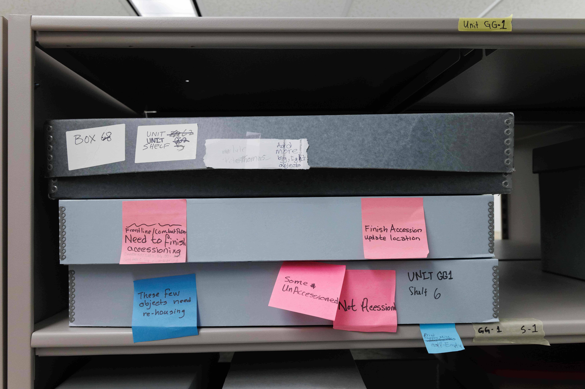

 Figure 4: Collections Palimpsest 

Looking for a specific item in the collection is a shot in the dark—PastPerfect only has the right location some of the time. Sometimes, it tells you the names of locations that no longer exist. Memory of what can be found where lives in the brain of Virginia, the director, and Ann, the volunteer who comes in once a week to work on collections.

It isn't just the organization style—in the hundred years since Hunter began collecting, his collection's focus has shifted too. The Papermaking Museum collects contemporary paper art as well as historical. They collect artist books and pop-up books. And contemporary papermaking equipment, such as a papermaking machine used by NASA in space. But unlike many other contemporary archives, the Museum has stuck to physical collections. Life in a digital era has introduced a shift in recordkeeping. More and more documents are born digital and require digital archiving. And documents that were analog are being digitized for accessibility. At the Georgia Tech Archives, collections featuring material of high research value documented via analog technologies are digitized and uploaded during the processing period. Take for instance the Marilyn Somers Living History collection—over 1000 living histories collected over a quarter century. The recording formats the collection is held in (VHS, DV cassettes, DVD) are a history of technology too, something that is diluted in the digitization process. Then there are the swathes of senior ISYE theses from the 1990s and 2000s that I've digitized and promptly recycled; these are tossed out for lack of space. And finally there are the documents we've digitized and transcribed because their original bodies are failing them. President Lyman Hall's documents fall under this umbrella—they've celebrated their quasquicentennial by crumbling apart. In order to make sure they remain viable for research, we need to make them digital. This shift to the digital makes sense in all three cases. Researchers can search OCR text from the comfort of their homes, yielding instant results instead of sifting through folder after folder of potentially relevant material. And archives are happy too, with less storage space and money devoted to preserving what could be online; less staff needed to manage a reading room. Of course, you need to ignore the cost of data storage and the potential of data corruption. Digital material resists preservation too, after all. But that is not the point; regardless, the Papermaking Museum's collection is impossible to digitize like this. An essay is an essay is an essay, but a 600DPI scan means nothing when the meaning of your artefact is how it lets light shine through it[^6]. It isn't just the meaning of the Papermaking Museum's artifacts you're preserving; it's the physical material itself. Or rather, the artifact's meaning isn't the same when digital. The stage is set. We know about Dard Hunter, and his journey into paper fanaticism. We know about the Institute of Paper Chemistry, its path to Georgia Tech, and the history of the Papermaking Museum. And we understand how archives collect and the affordances of physical media. Let's take a closer look at some of the artefacts, and how their materiality transforms their meaning in the museum.

### “the book harmonious”

The first stop we will take is at Hunter's self-published books mentioned earlier. These are love letters to the art of papermaking not just in content but in form. Hunter's first two books, _The Etching of Figures_ and _The Etchings of Contemporary Life_, were created entirely by him. He pulled his own paper, designed and made his own typeface, set his own type, and printed his own books.

Hunter took great care to make sure every aspect of his publications worked together to form “the book harmonious":  

> The man that produces consistent books in the future must be a typefounder and paper maker as well as a printer. By a typefounder is not meant simply a man who designs the letter but he must also cut the punches, strike them into the copper bars that go to form the matrices, and then justify these shapeless units to the hand mould from which he can cast his fount. The paper-making-printer must need know how to fashion the paper-moulds from brass and mahogany: he must be able to produce the watery fibrous pulp from the linen rags; and he must be able to form the sheet, give the “shake," couch the water leaf, and see the wet, tender sheet through the pressure press to the drying loft.
> 
> The paper should suit the type in regard to colour, size, laid and chain lines and thickness: also, the water-mark should conform to the title of the book in which the paper is to be used. The type and paper should combine, and this is not possible if each is made by distinctly different men without this unity in view.  

Hunter was the paper-making-printer that he dreamed of[^7]. His early books used paper made of cotton and linen rags dissolved in sodium hydroxide and boiled in calcium hypochlorite. This was then pulped in moulds produced with custom watermarks on either corner. His early paper was not perfect. Cathleen Baker, author of _By His Own Labor: A Biography of Dard Hunter_, comments on the paper's defects. Some sheets had a cloudy appearance under light, indicating an uneven pour with knots of fiber. The paper now features both foxing and discolorations, associated with iron depositions and uneven drying respectively. These stains would not have been present when he finished his paper but emerge from the paper now in an attempt to prevent preservation.

Hunter's font was an extension of his personality. Irregular and lively, it rejects the sterility of machine type and still feels handwritten[^8]. Handwritten type pairs well with handmade paper, and he hoped that his font captured “a freedom of stroke unknown today."

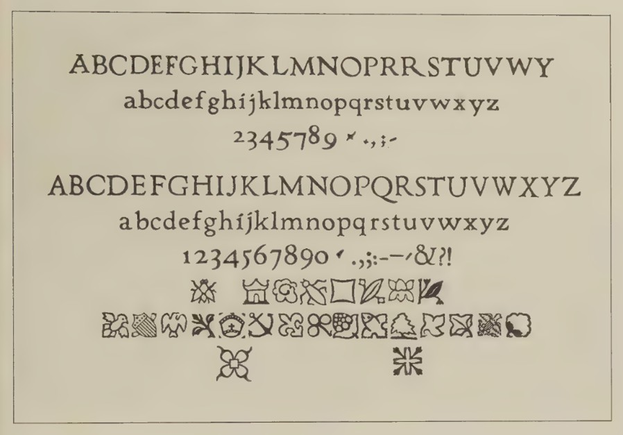

 Figure 5: Hunter's Typeface 

After these first two projects (_Etchings_), Hunter's books no longer featured paper made entirely by his hand, but he was involved in every step of the process. For the publication of _Old Papermaking,_ he sent his antique molds overseas to W. Green, Son & Waite, who helped him with his papermaking. After receiving a series of samples, Hunter received 25 reams of paper made to his exact demands. Unsure of their demand, he created his early books in limited batches of 200, and each is a microcosm of a museum. These books are educational; they are an extended exhibit that showcase Hunter's encyclopedic knowledge of papermaking. They each tell a story of papermaking—in his early books, European papermaking, and later on they detail “primitive" and “oriental" papers. The content of _Old Papermaking_ covers a history of not just early paper but printing, etching, engraving, and watermarking. Hunter goes into detail about the construction of moulds and deckles, about how to make multicolor watermarks, and pulling large paper. His books contain samples of paper inside them, lightly glued in its pages, each given a little label much like a museum. Labeled as “Specimens," some of these samples are original while others are hand-made facsimiles of primary materials from his private collection. And sure, there are some reproductions of original paper, but they are _just as real._  

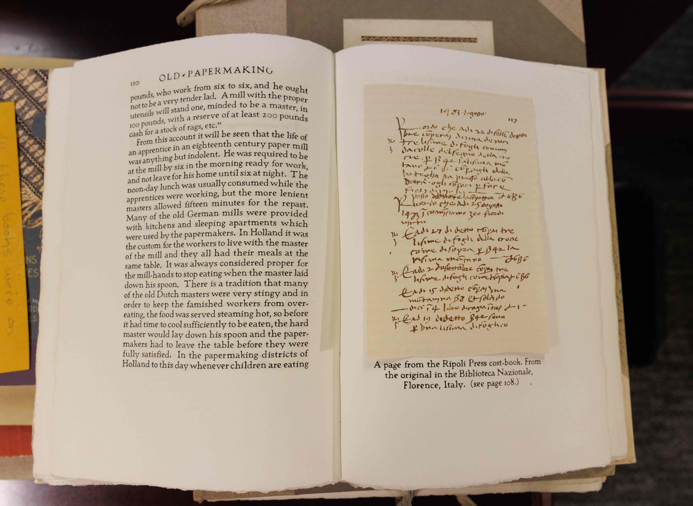

 Figure 6: Old Papermaking 

To Hunter, it was important that every part of the story of paper-making was told with the material on hand. He understood that it wasn't just the story of the paper that mattered, but the actual sheets too. Let's take a second to discuss another project that attempted to tell the story of a material through the real thing.

### Hough’s American Woods

How do you identify the trees around you? I suppose there is no need, most of the time, to know whether the tree whose shadow you bask under is chestnut or oak. You don’t need a name to enjoy the shade. But industrial applications care, especially when it is the turn of the 20th century and the timber industry is booming. Each species has different material properties. The same chair will look different in hardwood and softwood. It will feel different, and your eyes will notice the difference in the way the stain sets.

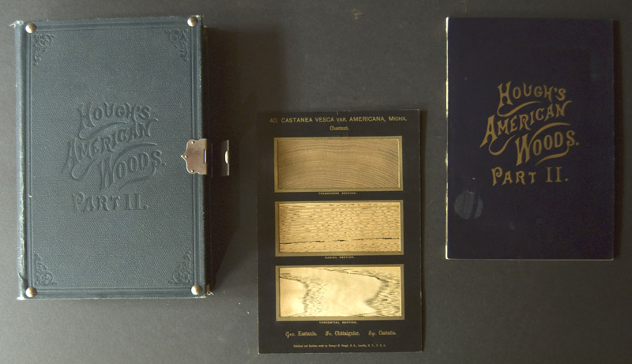

 Figure 7: American Woods 

Hough’s American Woods was a multigenerational project that aimed to document in detail the trees of North America, complete with samples[^9]. Romeyn Beck Hough, the son of Franklin Hough (widely regarded as “the father of American forestry”), initially trained as a physician at Cornell. He shared his father’s love of botany, however, and after taking inspiration from German botanist Hermann von Nördlinger’s _Querschnitte von Hundert Holzarten_ (an 11 volume series with cross sections of European wood), he began the arduous task of compiling a guide to American trees.  Around the same time, Romeyn patented a wood veneer cutter able to make horizontal, vertical, and transversal slices of wood as thin as 1/1200th of an inch. He sold these as magic lantern slides and business cards “for all fancy and business purposes.”

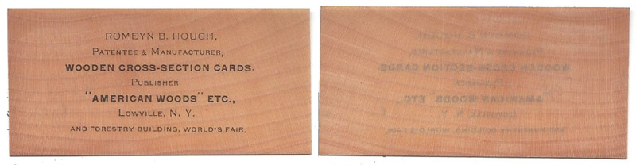

 Figure 8: Hough Business Card 

These veneers are cut so thin that light passes clearly through each sample, allowing every fine detail to be observed clearly. This same technology was used for _American Woods,_ and three samples of each species (horizontal, vertical, and transversal cuts) were carefully mounted in windows between bristol board. Each sample is accompanied with a detailed description of each species' physical characteristics, location, and industrial use. Beginning with a volume of New York species, he eventually published thirteen of fifteen planned volumes before dying. His daughter, Marjorie G. Hough, published volume fourteen from notes Romeyn had left behind. The books quickly gained popularity. One 1899 advertisement in _American Forests_ calls it “a work where the plant life does the writing, and which no one can read without thinking.”

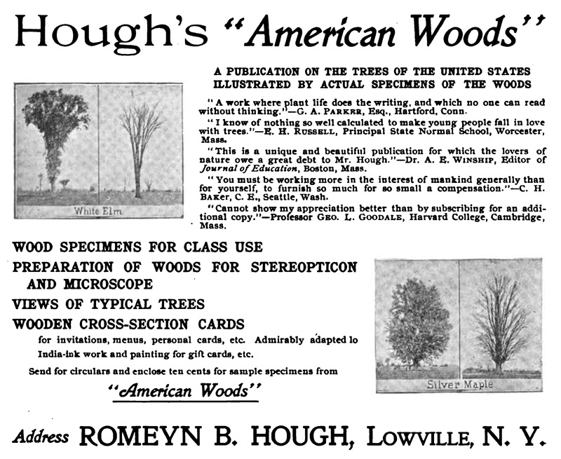

 Figure 9: American Woods Advertisement 

_American Woods_ then is a massive collaborative undertaking, each set authored by 354 specimens and two human assistants. How many hundreds of years did these 354 specimens collectively spend growing before they were harvested by Hough? How many animals did they nurture, how many birds did they shelter, how many travelers did they shade? And how much of America did they cover? These are books that annihilated the distance of time and space in their creation. _American Woods_ is a time and space capsule, compressing the country’s lumber industry at the turn of the century into fourteen volumes. In the hundred years since its publication, American forests have not remained constant.

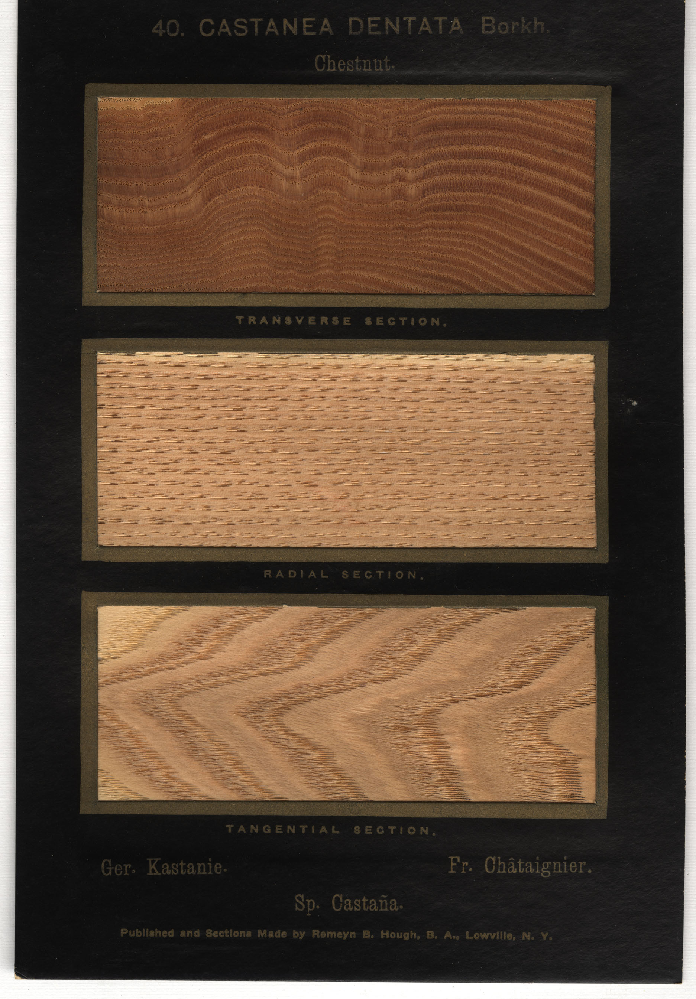

 Figure 10: American Chestnut 

  
Take the American chestnut. Devoured by blight, its population was decimated in the twentieth century. But it remains suspended in Hough’s volumes.

And it is not alone. Massive deforestation and blight has led to many species in the book becoming endangered or extinct. But in the archive they are safe, as long as they are maintained well[^10].

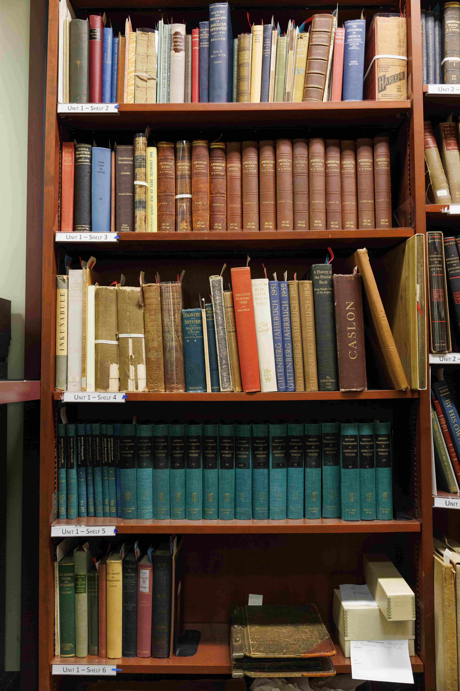

 Figure 11: Papermaking Museum Library 

The Papermaking Museum possesses two sets of Hough’s American Woods, stashed away in the collection's library behind two locked doors—one bound in a verdant green, the other an ochre brown. If we trace back their provenance, we find that one copy is Dard Hunter’s personal set, and the other belongs to the Institute of Paper Chemistry. As much intrinsic value as there is in this artefact, there is prescribed value too. Both the IPC and Hunter felt it important to collect this set, even as they approached it from different angles. The IPC used it as a commercial reference, and Dard picked up a set as a hobbyist. Here comes another point of friction in their collecting interest.

Let's compare _American Woods_ to Hunter's books. _American Woods_ is a museum too, but it tells a different story. While Hunter wrote a grand narrative of papermaking, Hough's work is more clinical in intention. Sure, each tree preserved in the book attempts to scream out its life story, but the accompanying text is stripped of their narrative. And what of their publication? _American Woods_ was published by Thomas J. Griffiths Printing, Binding, and Publishing from Utica, New York. Almost certainly the Houghs did not pick out their typeface, let alone hand-cut it. They used a standard serif font, one I haven't been able to identify yet. The font is clean staccato on the paper; the letters are evenly spaced and sized. Unlike Hunter's typeface which resisted an embrace of the “perfection" of mechanization, this is a font whose clinicality mirrors its text. The paper for the species descriptions was not chosen to resonate with the type—from what I can tell, Thomas J. Griffiths gave no considerable thought to its fibrage. The wood samples on the other hand were mounted with their materiality in mind—the bristol board was likely chosen as an appropriate material to frame the veneer in. Although these are undoubtedly still luxury volumes, this is not a book harmonious; the Houghs did not fill the paper-making-printer role that Hunter dreamed of. Like Hunter wrote in ‘The Lost Art of Making Books,' the separation of the paper-making-printer into its derivative roles “adds more personalities until the finished book becomes a conglomeration of ideas and workmanship." Hough's is a conglomeration—of hundreds of voices, both tree and human, that leave it a degree separated from Hunter's work.

### The Fibrary

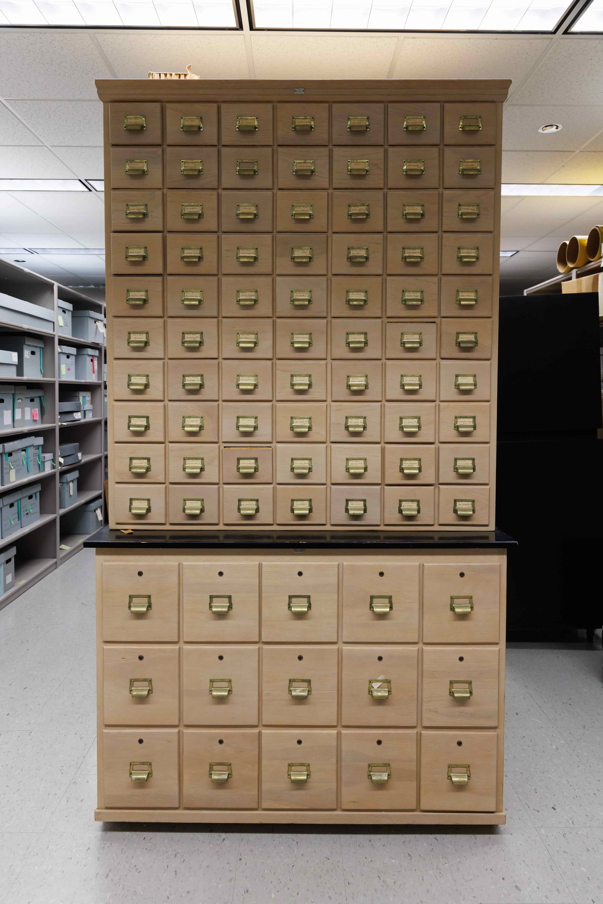

 Figure 12: The Fibrary 

The Fiber Identification Library, affectionately known as the Fibrary, is a comprehensive collection of fibers used in papermaking. The collection serves as a reference point for comparison between different fibers and is currently stored in a repurposed card catalog. Created for the IPC in 1950, it was founded and managed by Dr. Irving H. Isenberg (1909-2002).  This also happens to be the first set of artefacts at the museum I ever learned about.

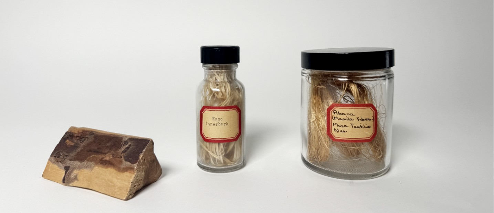

 Figure 13: Fibrary Sample 

On my first day of work, I walked in and looked at the Artefact of the Month. In the small glass display case were three samples from the Fibrary– Engelmann Spruce, Kozo, and Abaca– delicately arranged on tiny pedestals.

Dr. Isenberg received a Ph.D. in forestry from Berkeley in 1936 and was an early hire at the IPC. He remained there until his retirement in 1973, and taught classes in forestry and fiber identification[^11]. He coined the term Fibrary and wrote of it:  

> “This word is a new one to the writer, but whether or not it has been recently coined to add yet another to the scientist’s already lengthy vocabulary, the idea associated with it is certainly a good one. A rst[sic] catalogue of fibre specimens, with data as to pulping, held in the Fibrary of the Institute of Paper Chemistry at Appleton, Wis., has been published. It appears that a collection of fibres was started about 18 months ago and that samples of fibres are obtainable from the Institute. Most mill chemists keep a small hoard of samples of different kinds of fibres for use as comparison standards for microscopical examination, but it seems that a comprehensive and well-organized collection such as that contemplated at Appleton is an idea which may well be copied in this country.”

Isenberg knew the importance of a collection of fiber. Keeping reference material on hand wasn’t an uncommon habit in labs, but the IPC had a library larger than most. At its peak in 1974, the Fibrary had 662 samples, each accompanied by a meticulous set of measurements.  Most of the Fibrary is composed of samples of common material. Most, if not all, of the plants used in the papermaking processes Dard Hunter wrote about in his books have made their way into its catalog. But while Hunter collected the end result, the Fibrary sought to classify the papers before they were even pulped. The Fibrary was a living collection in ways most archives aren’t. Sure, fibers were being added to it constantly, but snippets of fiber were also being removed for destructive chemical testing and comparison. So what is the significance of the Fibrary? What does it mean? What is the archival value of this papermaking charcuterie board?

On the surface level, there is no immediate, inherent value to the materials in the Fibrary. In most other archives, the Fibrary would be sort of meaningless in a material sense. What use is a card catalog of plant fiber to a random archive? But its location at the Papermaking Museum gives it meaning. The Fibrary is built on layers of abstractions, existing somewhere between _plant_ and _paper_. And through the course of history, much like the museum itself, the collection has undergone a transformation in meaning. Although it started out as a hoard of samples for experimentation, it’s turned into an archival spectacle. To the best of the museum's knowledge, the Fibrary hasn't been used for research since the IPC's move to Atlanta in 1989. Its era of being organized and scrutinized in scientific terms has passed. No, now it’s stored in a card catalog and is being accessioned and processed by student workers; box by box we’re transforming the meaning of this assemblage of fibers. Our modern times are changing this place of experimentation into a static archive.

Much like _American Woods,_ it was curated for industrial application. The Fibrary was a catalogue designed to allow consistency in industrial paper, it sought to erase the variability in hand papermaking that Hunter embraced. It is even more clinical than Hough's work, each fiber is stored in a separate box. Hough personally chose each tree to sample for his book, but with the Fibrary, the provenance of each fiber has been lost to time. And think of its housing—where Hough and Hunter used pages in their books to trap their material, the Fibrary uses card catalog containers.  

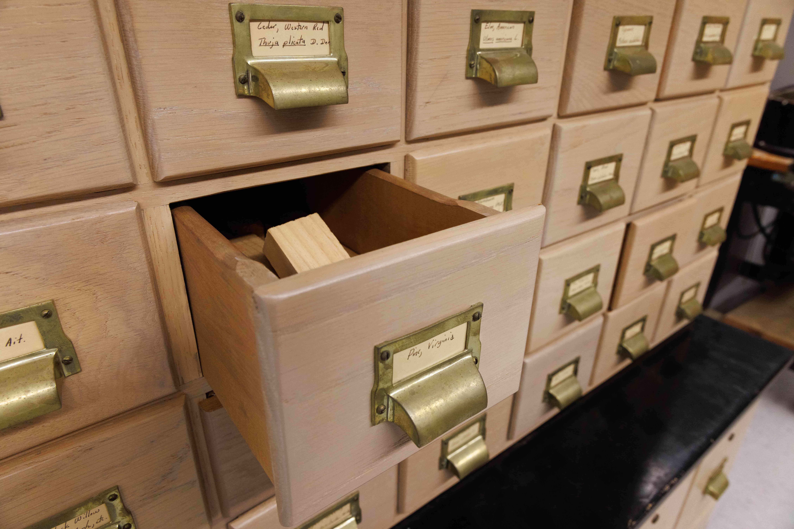

 Figure 14: Fibrary Drawers 

This catalog is made of wood too; somebody labored to cut it down to perfect size, glue the pieces together to make each drawer, nail the handles in. At some point an employee of the IPC or the Papermaking Museum handwrote each of the labels. If there is no paper and no type, can the Fibrary still fit into a concept of the book harmonious? And I don’t know what tree it's been constructed of, but isn't there a great irony in the possibility of the catalog holding itself in its drawers?

As abstracted from hand papermaking as it is, it still depicts parts of the papermaking process. The Fibrary is step one—harvesting the plant—and Hunter's collection is almost wholly the final one, of creating the paper itself. But both of these are important in the story, in the Museum you cannot have one without the other. Indeed, if you walk into the Museum's Mead Gallery, you’ll notice a faded black case that juxtaposes handmade papers with their respective fibers.

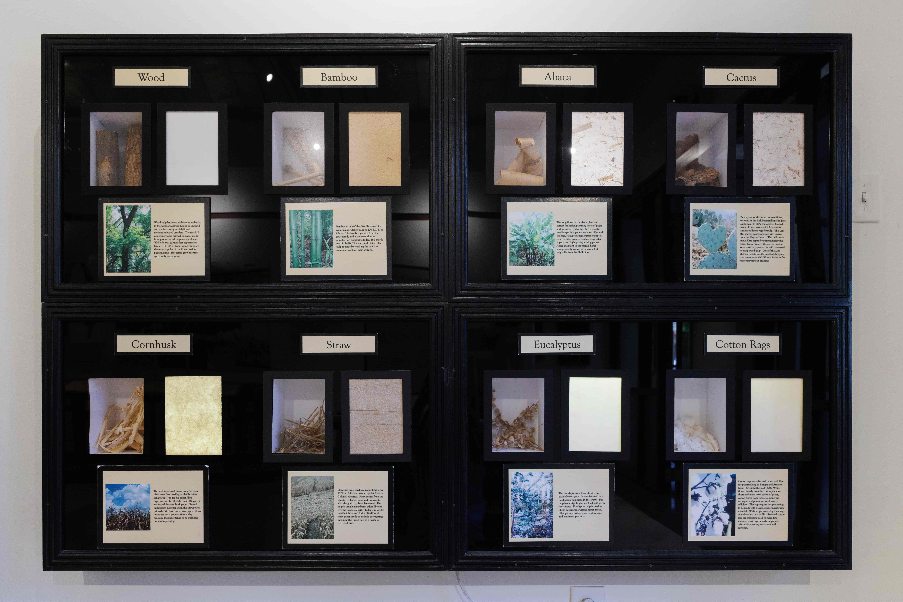

 Figure 15: Fiber and Paper 

Dim lights shine through the paper, illuminating the thicker strands of its constituent fibers. This permanent display is a marriage of Hunter's paper collection and the Fibrary. It shows both the harvested material and its end product, and the combination reveals their true meaning.
### Growing an exhibit of the future

We seem to be abstracting downstream from paper and process with each step. First were Hunter's volumes, each handmade book featuring inset samples of real and reproduction paper. Then comes Hough’s _American Woods_; a book still, but one with lumber inside its pages. The veneer represents a possibility, a material whose form is undecided. And then comes the Fibrary. We’ve lost the form of the book (at least in a traditional sense), we’ve lost the medium of paper. We’re back to a queer collection of raw material whose meaning is found in its context. The next step, naturally, is another abstraction away from fiber. If the Fibrary classified papers pre-pulping, we need to stop even before material collection.  

The Papermaking Museum’s next project is to install a fiber garden outside of the museum. In front of the building is an empty lawn and dormant fountain. Here, the museum hopes to plant common hand-papermaking and natural dye plants so they can be used for workshops and feature a living exhibit in ways the Fibrary can only dream. It bridges both Dard’s and IPC’s visions of material and paper in the museum.  

This is an idea that has been floating in the back of the Museum's mind for a while, and has slowly started manifesting in different ways. Harkening back to Hunter's original interest in paper, the Museum is hosting a three-part workshop in conjunction with Trees Atlanta called “Forest to Fiber: Papermaking from Invasive Trees." In the first session, participants will harvest mulberry trees from the Connally Family Cemetery with Trees Atlanta, helping restore the site; in session two they will learn how to process the fiber by scraping and beating it; and in session three they will make their own sheets of paper with the resulting pulp. Unlike the school tours, the paper will be airdried, following a pre-industrialization model of papermaking.

Steps are also being taken to realize the fiber garden. Two student workers at the museum are building a web catalog of the plants that will be planted, gathering information about each plant not dissimilar to the profiles Hough created a century ago for trees across America. Once the garden is planted, each plant will have a little placard with a QR code linking to a webpage with this information for handy access. With this, the Museum has finally caught up with the digital age, but is the price too steep? Whatever plastic or metal sign gets erected in front of the plants loses its meaning once we've forgotten how to read QR codes. The sign itself is devoid of a story; it's just an arrow pointing into the digital world. Hunter, Hough, and the Fibrary aren't gone yet though. The fiber garden is only slightly downstream; their presence remains, and they solidly resist the easy digitization of tomorrow's archives.

### Works Cited
Baker, C. (2000). _By his own labor: The biography of Dard Hunter_. Oak Knoll Press.

Dard Hunter, 82, an Authority On Paper and Printing, Is Dead. (1966, February 22). _The New York Times_, 21.

_DardHunter.com_. (n.d.). Retrieved from [https://dardhunter.com/](https://dardhunter.com/)

_Fiber + Pulp | Robert C. Williams Museum of Papermaking_. (n.d.). Retrieved from [https://paper.gatech.edu/fiber-pulp](https://paper.gatech.edu/fiber-pulp)

Hough, R. B., & Hough, M. G. (1888). _The American woods: Exhibited by actual specimens and with copious explanatory text_.

Hunter, D. (1923). _Old Papermaking_.

Hunter, D. (1958). _My life with paper; an autobiography_. New York, Knopf.

_Institute of Paper Chemistry | Lawrence University_. (n.d.). Retrieved from [https://www.lawrence.edu/library/university-archives/university-milestones/institute-paper-chemistry](https://www.lawrence.edu/library/university-archives/university-milestones/institute-paper-chemistry)

Lawrence University. (1929). Lawrence Gets Institute; 90% State Mills Aid. _The Lawrentian_, _XLVII_(11). [https://lux.lawrence.edu/lawrentian/938](https://lux.lawrence.edu/lawrentian/938)

_Robert C. Williams Museum of Papermaking_. (n.d.). Retrieved from [https://paper.gatech.edu/](https://paper.gatech.edu/)

_Romeyn B. Hough_. (n.d.). Retrieved from [https://microscopist.net/HoughRB.html](https://microscopist.net/HoughRB.html)

_The American Woods_. (n.d.). Retrieved from [http://www.codex99.com/design/the-american-woods.html](http://www.codex99.com/design/the-american-woods.html)

Wang, M. (n.d.). _Maharam | Story | Hough’s American Woods_. Maharam. Retrieved from [https://www.maharam.com/stories/wang_houghs-american-woods](https://www.maharam.com/stories/wang_houghs-american-woods)

Wilhoit, M. M. (n.d.). _From Appleton to Atlanta: The Institute’s First 75 Years_. Sun Fung Museum Books and Catalogs.

### Picture Credits

Figure 1: “Dard Hunter"  
Portrait of Dard Hunter in profile, wearing a suit and tie. Original caption: "Dard Hunter, Chillicothe, Ohio". Original credit line: Dard Hunter, Papermaking Library.  
_Image courtesy of MIT Museum. GCP-00011301._

Figure 2: “Dard Hunter Paper Museum"  
A view of an exhibition in the Dard Hunter Paper Museum while it was at MIT. The exhibit cases in the center of the room display books and prints. On view on the walls surrounding the cases are framed works on paper, and papermaking tools and equipment.  
_Image courtesy of MIT Museum. GCP-00011313._

Figure 3: “Watermarks in the Japanese Manner"  
A detail of an exhibition in the Dard Hunter Paper Museum while it was at MIT. Shown are fourteen watermarked papers, some with portraits, paintings, and buildings. Original caption: “Dard Hunter Paper Museum, Massachusetts Institute of Technology. In the Paper Museum the windows are arranged in the Japanese manner and show various watermarks dating from the beginning of the art to the finest light-and-shade papermarks of the present day. The work of the most renowned watermarking artists of all countries and all periods may be studied."  
_Image courtesy of MIT Museum. GCP-00011315._

Figure 4: “Collections Palimpsest"  
_Photograph by author._

Figure 5: “Hunter's Typeface"  
_Image from Cathleen Baker's By His Own Labor._

Figure 6: “Old Papermaking"  
_Photograph by author._

Figure 7: “American Woods"  
_Image found on microscopist.net._

Figure 8: “Hough Business Card"  
_Image found on microscopist.net._

Figure 9: “American Woods Advertisement"
*Image found on microscopist.net. Original advertisement unknown.*

Figure 10: “American Chestnut" – Hough's American Woods.  
_Image courtesy the Beinecke Rare Book and Manuscript Library, Yale University._

Figure 11:  “Papermaking Museum Library"  
_Photograph by author._

Figure 12: “Fibrary"  
_Photograph by author._

Figure 13: “Fibrary Samples"  
_Image courtesy of Robert C. Williams Museum of Papermaking._

Figure 14: “Fibrary Drawers"  
_Photograph by author._

Figure 15: “Fiber and Paper"  
_Photograph by author._

## Reflection
Initially, I was going to make some substantive edits to my thesis to flesh it out more. Make it reflect my original intent, you know. But I think I kind of prefer this to be a time capsule of my writing– theoretically, this thesis is the culmination of my five years at Tech. It should be built on all of the theory my classes in science studies have exposed me to; written with the language I’ve honed through my curriculum; and (due to my thesis’ subject matter) rooted in the material practices of the work I’ve done at the Archives and Library. 

I think it is all of these, to some extent. I’m proud of the logic that scaffolds my thesis, of the analytical path I took. For the people that this will mean anything to: my two primary theoretical influences were Donna Haraway’s *Awash in Urine* and Bruno Latour’s *Circulated Reference*. I borrowed the idea of “downstream” from both Haraway and Latour– for Haraway, it is literal when tracing the medicine upriver, while for Latour it is less so. But both works were key in informing the style I used to write this thing, and how I structured the artefacts.

I also tossed in two subtle references to two of my favorite readings of this semester. There is a reference to the title of a reading I did for Science, Technology, and Race titled *Annihilating Space, Time and Difference*. This detailed the cultural impact of the invention of the telephone. I also make allusions to the idea of “the real thing” at least once or twice in this essay. I’ve been thinking about what it is to experience *the real thing* ever since [[Pomegranate Seeds|reading Asako Yuzuki’s Butter]] earlier this year, and what the real thing is in the context of an artefact’s meaning.

I also created my own font for this thesis. Unfortunately, this webpage is not rendered in it because I’m not a competent web developer. The one change I made to my thesis’ content is updating a footnote that referenced the font the thesis is printed in.

### Things I wanted to improve upon
- Remake the font to be handmade and not image traced
- More thorough analysis on Hunter’s work, including
- Pictures of Isenberg
- Examples of the specimen sheets of the Fibrary
- Higher quality artifact pictures. They suck.
- More accurate information about the garden
- Print my thesis on handmade paper
- A section on material resisting preservation, connected to the preservation challenges of each artefact
- More research overall

### Original trajectory
The current narrative frame of the essay is pretty straightforward and uninteresting. My first idea was to focus on Hunter’s past as a magician and use that as a key point in the thesis. I wanted to spin an extended metaphor of the Papermaking Museum’s collections being Hunter’s final, most wonderful magic trick. It’s a trick that has shifted shape across the past century, but is one we continue to contribute to. I couldn’t figure out how to write it with that narrative so I kind of gave up and stuck to a simpler version. 

I also had the idea of comparing archiving to alchemy– of transforming mundane boxes into archival gold– but my professor warned me about using “*alchemy*” as a term so lightly. Probably a good idea to shy away from such charged language in my thesis, but I want to revisit this in the future for my blog. My mind went to the history of the museum and archive and how it mirrors the pursuit of alchemy. Half-cooked thoughts that I’ll let stew in my head a little longer before they emerge.

### The sparknotes thoughts
I am proud of what I wrote. But it’s also a bit disappointing at how little effort I feel like I put in for the culmination of my degree. This was, at the end of the day, a product of two weekends of panicked writing, and a few weeks of scattered research. My work ethic was, as usual, kind of abysmal and my editing process wasn’t as rigorous as it could be.

But I’ll take this thesis as a proof of concept and a badge endowing me with self-confidence. I *can* write something this long. I *can* write something that is (at least I think it is) an engaging read. And of course, I have so much more potential and room for improvement.

And to you, dear reader, if you actually read through all of this, I thank you kindly. Please let me know your thoughts on it, I’m eager to find out.

[^1]: A plant from the banana family.

[^2]: Or some variation therein—we change it up based on what's available.

[^3]: William Morris (1834-1896) was a Victorian artist who designed patterns for fabric, stained glass, wallpapers, and more. His design work and philosophy essentially kickstarted the Arts and Crafts movement, which was a worldwide movement to revitalize the arts in response to a perceived decline in artistic quality as a result of mechanization. It's easy to see why Dard became one of the prominent North American leaders of the movement, with his obsession over hand-made art.

[^4]: In the interest of focusing the narrative on the Papermaking Museum’s artefacts, I’m not following the story of the London Science Museum any further. But if you unraveled the threads of this story to their very end, how many new actors would you find? What did it take for the London Science Museum to exist? What forces drove the museum to make this specific exhibit? Without it, Dard Hunter’s papyrophilic tendencies might never have begun.

[^5]: Hunter's font will come up again with more detail later, but a recreated version of the font is what this essay was originally printed in.

[^6]: There are cases when the museum requires digitization—I've digitized stereograph cards on display for reproduction. But the vast majority of the collection cannot be digitized meaningfully like this.

[^7]: Interestingly, Hunter didn't bind his own books, or view that as a step of the book harmonious.

[^8]: The top font is Dard's and the bottom Dard Jr.'s. You might notice that some letters and numbers are missing from Hunter's set. He made all the letters but did not cast an uppercase Q or Z, and made two versions of R. The numbers 1, 6, and 0 were modified from existing type— 1 was 'i' with the dot chiseled off, 6 was a flipped 9, and 0 was an 'o' with its sides chiseled in.

[^9]: Some accounts state that Franklin, who was widely regarded as the “father of American forestry,” conceived the project, but died before it could begin. Franklin was the first chief of the United States Division of Forestry, the precursor to today’s Forest Service.

[^10]: Hough's volumes are prone to similar environmental damage that stained Hunter's paper. There is not quite enough time in this story to cover the physical conditions of object preservation, so I will try and condense it into a single thought. In much the same way that the Museum's collection resists easy organization, it resists easy preservation too. It's not enough to set aside space for each artifact. You have to make sure wood isn't offgassing, that sheets are interleaved with acid free paper, that the temperature and humidity of Collections is well monitored.

[^11]: Isenberg, too, was inspired by Hough and made his own version of _American Woods,_ in the form of _Pulpwoods of the United States and Canada_. This book focused on trees usable in papermaking, and although it lacked physical samples, contained comprehensive measurements and data about each species. It became an indispensable reference book in the pulp and paper field. – “For each of 46 conifers and 38 hardwoods, details are given of: scientific and common names; geographical distribution range; silvicultural characteristics; av. tree dimensions; pathology; gross features of the wood; microscopic structure of the wood and bark; physical and chemical properties of the wood and bark; pulping characteristics; and other uses of wood and bark. Summary tables are presented on: tracheid dimensions and decay resistance; wood and bark specific gravity [relative density]; calorific value of wood and bark; chemical composition of wood; and chemical composition of bark. A glossary of 41 terms is reproduced in each volume.”
