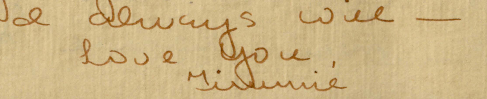

Names are important. Names tell a story. They're one of the first gifts a child is given. And when a person dies, they're often one of the longest markers to remember them by. Names are especially important in the modern archives-- they're so often the identifier of artefact.

### Hall/Robertson Files

I'm a student worker at the Georgia Tech Library and Archives, and my current project has me swimming in names. I'm going through a batch of digitized letters, postcards, and photographs donated by the extended family of Lyman Hall[^1], and marking down the author and recipient of each file in a massive spreadsheet.

It's an effort to create a searchable database of these files so that researchers can have marginally more information to go through when researching these topics (your search result won't be "1921_08_06.pdf" but rather "Henry Clay Robertson writing to Mary Elizabeth Mikell[^2]").

Here, names are valuable. These artefacts are letters, not poems. They don't have handy titles that summarize their content, and it wouldn't be right of me to impose titles on them either. Besides, it's quicker to process collections if I just look at the authors and label them (although I'm easily distracted and end up reading the interesting ones anyways).

In theory, as processing archivists we can't spend too much time on processing at the item level. We want to preserve everyone's story. If I can't read a name, I flag it for later and move on. If the same unintelligible scrawl shows up multiple times, well, now I need to pay attention, and this [ghost, term for a whisper, someone] becomes something I think about a bit harder.

A few days ago, I came across a signature that I couldn't quite read. See, although some of these letters are telegrams or typewritten, most are written in a quick cursive that pushes the bounds of my elementary-level knowledge of this dying art. I usually do pretty well (and I've gotten significantly better over the past few years) but after staring at the bottom of the page for a few minutes, I decided I couldn't figure it out and moved on to the next file. But the letters kept coming in, each closing with the same scrawling signature.

These were mostly love letters, and I looked back at the catalog to see who else had written to Lyman in this way. From what I could tell, his latest girlfriend was Julia. The signature looked an awful lot like it started with a "J" and looked kind of like "Jimmie".

(am I allowed to show this? who knows!)
### "Jimmie", and names in the archive

To a contemporary eye, names and nicknames of the archives can be strange. I'm no stranger-- I've been working with similar assignments for a few years now. George becomes 'Geo.', William becomes 'Wm.', and James becomes 'Jas.'; mothers and aunts call their daughters and nieces 'sister.' Some of these rules are universal writing shorthand, others are geographic or genealogical. None are written down in a handy reference table for me[^3]; these were all common knowledge to the authors.

So it wasn't entirely out of the question for "Jimmie" to be a family nickname for Julia. Previously in this set of letters, I'd seen Henry Clay Robertson sign off all his letters with "Harry", so why couldn't Julia be Jimmie? I sent a message to my boss on Teams along the lines of *hey, does this look like Jimmie to you too?* and she agreed. So that was that, I had my answer. 

But I was still skeptical.

These letters were intimate, romantic, and full of yearning. And the idea of Julia's nickname being *Jimmie* opens up questions of gender and queerness[^4], invites me to wonder about Julia/Jimmie's life and how it went. They're not who Lyman Hall Robertson married[^5]-- no, that pleasure went to Constance B. Truxton, a figure I haven't come across in correspondence yet. 

So what happened to Julia/Jimmie now? Are they two people or the same? 

They're surely dead and gone now, or at least close to it; these letters are from the 1930s, between two children who'd just become adults. I do technically have the option to contact the living donor who donated this collection and ask any familial questions I might have, but the chances they know about this fling of Lyman Hall are slim. And what about other collections-- those whose donors have passed; whose contents have fallen out of living memory; those that, in the nicest way possible, are about unimportant people in history[^6]?

Even though an archive can present itself to be a whole picture of the past, they're always limited by the knowledge and perspective of the processor.
### A resolution

A week after I started drafting this post I realized that the letters were all signed "Timmie," short for Emily Virginia Timmerman, not "Jimmie"[^7]. There was a large letterhead on some of her letters that clearly listed her name. 

Hey; in my defense, the first few letters from Timmie didn't have a letterhead. I was going off of vague context and similar handwriting.

But this is a great example of how easy it is for a name to slip by! One simple mistake could have written a different version of history, and it would have been validated as fact the minute this collection description got published. 

I guess there should be a Point or something to this, so here: Archives are made by humans. They are just as error- and bias-prone as any other way of recording history. It's important to never treat the archives as whole truth! just the starting point for your exploration of the past.

-----
### Title Credits

I'm going to start naming some posts after songs on my mind, ones that have some kind of connection to the material I'm writing about. There were two contenders for this week: [Wake Up Jimmy (Something Is Happening Outside)](https://youtu.be/Wi1vNrkWiBU) by Montage and [Tea for the Tillerman](https://youtu.be/070ecdv7vr0) by Cat Stevens.

[^1]: Not the American founding father, but instead the 2nd president of Georgia Tech. There is no relation between the two beyond name and state of residence. Many of my larger projects at work have focused on his collections and orbit.

[^2]: This letter stands out to me because baby Lyman Hall has bought a goat! an amusing letter

[^3]: There *is* a [Wiktionary page](https://en.wiktionary.org/wiki/Appendix:Abbreviations_for_English_given_names) about this which I later found out about.

[^4]: And speaking of queerness, just the other day I came across what appears to be lesbianism in the archives. Lyman Hall's sister, Mary, writes: *"Dewar is still the crush. I've tried to forget her to see if I really still loved her. The attempt didn't work for the same questions still rake my brain every day-- what is she doing now-- if I could only see her-- if she'd only write me, etc. Something's going to happen soon for I feel it in my bones. I'm either going to run across her or something. Everything she's ever done or said, sometimes even her face, haunts my..."* and here the letter is cut off, a missing scan. This kind of blew my mind when I came across it, I won't lie. The year is 1935. Is this Southern mannerism or lesbianism?

[^5]: And the matter of Mary's lesbianism becomes even queerer a few letters later, when she *once again* brings up Dewar and writes *"Dewar is still the one. I saw her Sunday all dressed in white and, boy, did she look sweet! Gosh, Lyman, she'd be just right for you. Why don't you get to work?"* In this same postcard she brings up a double-date she'd just been on because a friend had asked. Comphet or bisexuality? There is no clear answer in the archives because my only information on Mary's identity is bits and pieces in three or four letters.

[^6]: Like Mamie Booth Kimball whose collection I promised in the summer of 2024. Mamie Booth Kimball was the first woman in Georgia to try a murder case. She had a rich career in a time when women rarely did. I know it's presumptuous of me to say without knowing who she is survived by, but that summer was probably the first time in a long while anyone spent so long looking into her life's history. I am very glad it's preserved! But I don't know how many people will be looking into her. And the decisions I had to make in materials to discard soured me to the idea of a job in processing. It's something I'm glad to do as a college student for experience and pay, but definitely not for a permanent career. I'm too easily attached to ephemera for that.

[^7]: And honestly, the letters *not* being from Julia threw a wrench in the narrative too. My only knowledge of Lyman Hall Robertson comes from letters I've seen addressed to him. I know nothing of his voice, only what his friends and family choose to share with him. As I piece together his personality through the margins it's difficult to tell what the "real" picture of his personality is. And the trick, of course, is that there's no way for me to know, and people are more complex than a single perspective can ever provide.
